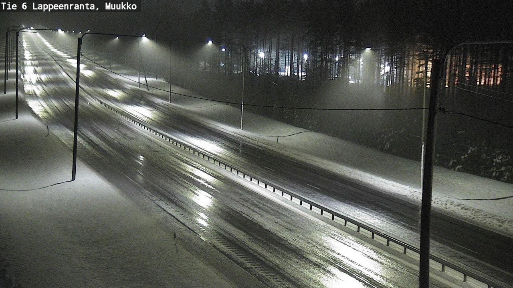

# Demo Scenario 1


<!-- WARNING: THIS FILE WAS AUTOGENERATED! DO NOT EDIT! -->

The goal of this demo is to demonstrate the utilities to dynamically
import new tools via GPT Function calling, as well as incorporating some
of our built-in tools in a relevant use case.

The scenario in this demo is a user wanting to retrieve information
about traffic information. Without our application, the user needs to
access an online service (e.g., Road DigiTraffic) about traffic
information, navigate through the website UI, and making requests to the
service with appropriate commands / UI navigation. However, the problem
in this manual approach is that it can be time-consuming, prone to user
error, and inefficient, especially if the user is unfamiliar with the
website’s interface or the specific commands required. It is also
difficult for the user to combine the information with other utilities.

Our application can resolve these issues by dynamically importing API
endpoints as tools for GPT FC. API endpoints are the backbone of an
online service, so directly importing them as tools mean that GPT FC can
operate all utilities available to the user. With this setup, GPT FC can
interpret the user’s chat instructions, automatically operate the
appropriate functions, and provide accurate, real-time traffic data
efficiently. This simplifies the process of navigating through the
utilities of a service and ensures that users can easily combine the
information with other tools or workflows.

## Step 1 - Preparation

For this demo, to fully demonstrate the dynamic imports via GPT FC, we
will import only functions from `llmcam.utils.store` as built-in GPT FC
tools. This function will be responsible for dynamically importing any
tools that we use subsequently.

At this step, the main tasks are:

- Import `llmcam.core` modules and `llmcam.utils.store` module.  
- Set up initial `tools` list and its handler as instructed in
  `utils/01_store.ipynb` notebook.  
- Verify set up with GPT messages.

``` python
# Import all the necessary modules
from llmcam.core.fc import *
from llmcam.core.fn_to_schema import *
from llmcam.utils.store import *
```

``` python
# Set up `tools` list and `execute_handler` function
tools = []
def execute_handler(function_name, **kwargs):
    execute_handler_core(tools, function_name, **kwargs)

# Add default tools from `llmcam.utils.store` built-in functions
tools.extend([handler_schema(function, service_name="toolbox_handler", fixup=execute_handler) for function in [
    add_api_tools,
    add_function_tools,
    remove_tools
]])
```

``` python
# Start the conversation and verify the tools
messages = form_msgs([
    ("system", "You are a helpful system administrator. Use the supplied tools to help the user."),
    ("user", "What tools can you use?")
])
complete(messages, tools=tools)
print_msg(messages[-1])
```

    >> Assistant:
    I can add, remove, and manage tools related to API services and function tools within the
    `functions` namespace. I also have a capability to execute multiple tool operations in parallel
    using the `multi_tool_use.parallel` function. If you need a specific API or functionality, let me
    know, and I can manage the tools accordingly.

The GPT agent should list all the 3 built-in tools from
`llmcam.utils.store`.

## Step 2 - Integrate Road DigiTraffic

At this step, we will integrate Road DigiTraffic via its base API
service and OpenAPI Specification file. This service is public and users
can retrieve traffic information by accessing its API endpoints with
HTTPS requests. The official documentation is available at:
https://www.digitraffic.fi/tieliikenne/. The base URL for making
requests is https://tie.digitraffic.fi, while its OAS file is
downloadable from the URL
https://tie.digitraffic.fi/swagger/openapi.json.

As such, this service provides all information we need for incorporating
it to GPT FC via `llmcam.utils.store`. It is also without the use of
tokens or security schemes that our service is currently not accounting
for. In this demo, we can use it to retrieve information about weather
cameras and thereby incorporate further with our vision modules.

The main tasks for integrating Road DigiTraffic include:

- Add Road DigiTraffic with necessary information.  
- Check for available tools.  
- Make a request about weather camera stations.  
- (Optional) Prune tool call results as response from Road DigiTraffic
  can exceed maximum tokens.

``` python
# Add a new API service called 'road_digitraffic' with necessary details
messages.append(form_msg(
    "user", 
    "Add a new API service called 'road_digitraffic'. \
Use the base URL 'https://tie.digitraffic.fi', \
and the OpenAPI Specification URL 'https://tie.digitraffic.fi/swagger/openapi.json'."
))
complete(messages, tools=tools)
print_msg(messages[-1])
```

    >> Assistant:
    The new API service 'road_digitraffic' has been successfully added with the base URL
    'https://tie.digitraffic.fi' and the OpenAPI Specification URL
    'https://tie.digitraffic.fi/swagger/openapi.json'.

``` python
# Verify the added API service
messages.append(form_msg("user", "What tools can you use?"))
complete(messages, tools=tools)
print_msg(messages[-1])
```

    >> Assistant:
    I now have access to the following tools within the `functions` namespace:  1. **Road Digitraffic
    API Tools** (from the recently added 'road_digitraffic' service):    - Access various endpoints
    related to traffic measurement, weather stations, maintenance tracking, and more.  2. **Multi Tool
    Execution**:    - `multi_tool_use.parallel`: Execute multiple tools in parallel when they can
    operate independently.  If you need specific functionalities or data, feel free to ask, and I can
    use the appropriate tool.

``` python
# Make a request to the 'road_digitraffic' API service to get the traffic information
messages.append(form_msg("user", "Can you tell me where exists traffic jam right now?"))
complete(messages, tools=tools)
print_msg(messages[-1])
```

    >> Assistant:
    There is a traffic situation report for a traffic jam right now:  - **Location:** Road 6,
    Lappeenranta, Finland - **Nature of Incident:** Preliminary accident report - **Specific Location:**
    Between Laihian junction bridge and Muuko interchange - **Coordinates:** Path through multiple
    points from [28.315513, 61.073364] to [28.348438, 61.084576] - **Start Time:** December 19, 2024,
    23:08:00 UTC - **Expected End Time:** December 19, 2024, 23:38:14 UTC - **Additional Information:**
    [Traffic Information and Road Conditions Online](https://liikennetilanne.fintraffic.fi/) -
    **Contact:** Fintraffic Tieliikennekeskus Tampere, Phone: 02002100, Email:
    tampere.liikennekeskus@fintraffic.fi  If you need more detailed information about other locations or
    traffic situations, let me know!

``` python
messages = [ message for message in messages if message["role"] != "tool" and message["content"] != None ]
```

## Step 3 - Integrate `llmcam.vision` modules

We can combine the information about weather camera stations with our
existing functions to capture images from weather cameras and detect
objects in images. To demonstrate further the utilities from
`llmcam.utils.store`, we can try dynamically importing this built-in
functions with GPT FC.

In this step, the main tasks include:

- Add necessary tools with full module source and function names
  [`llmcam.vision.dtcam.cap`](https://ninjalabo.github.io/llmcam/vision/dtcam.html#cap)
  and
  [`llmcam.vision.yolo.detect_objects`](https://ninjalabo.github.io/llmcam/vision/yolo.html#detect_objects).  
- Make command to capture image from a specified weather camera and
  detect objects from it.

``` python
# Add the functions `llmcam.vision.dtcam.cap` and `llmcam.vision.yolo.detect_objects` to the new service 'vision'
messages.append(form_msg(
    "user", 
    "Add a new service called `vision` with the functions `llmcam.vision.dtcam.cap` and \
`llmcam.vision.yolo.detect_objects`."))
complete(messages, tools=tools)
print_msg(messages[-1])
```

    >> Assistant:
    The new service 'vision' has been added with the functions `llmcam.vision.dtcam.cap` and
    `llmcam.vision.yolo.detect_objects`. If you need to utilize these functions, feel free to ask!

``` python
# Use the functions to show an image with a weather camera and detect objects in it
messages.append(form_msg(
    "user", 
    "Show me an image in Lappeenranta with a weather camera \
and detect objects in it."))
complete(messages, tools=tools)
print_msg(messages[-1])
```


    image 1/1 /home/nghivo/tinyMLaaS/llmcam/data/cap_2024.12.19_23:26:51_Imatralle_C0352901.jpg: 384x640 (no detections), 47.9ms
    Speed: 6.6ms preprocess, 47.9ms inference, 51.8ms postprocess per image at shape (1, 3, 384, 640)
    >> Assistant:
    Here is an image captured from a weather camera in Lappeenranta:  
    Unfortunately, no objects were detected in this image. If you have any other requests or need
    additional information, feel free to ask!

``` python
# Display the downloaded image
from IPython.display import Image
Image("/home/nghivo/tinyMLaaS/llmcam/data/cap_2024.12.19_23:26:51_Imatralle_C0352901.jpg")
```



## **CONVERSATION TRANSCRIPT**

``` python
print_msgs(messages)
```

    >> System:
    You are a helpful system administrator. Use the supplied tools to help the user.
    >> User:
    What tools can you use?
    >> Assistant:
    I can add, remove, and manage tools related to API services and function tools within the
    `functions` namespace. I also have a capability to execute multiple tool operations in parallel
    using the `multi_tool_use.parallel` function. If you need a specific API or functionality, let me
    know, and I can manage the tools accordingly.
    >> User:
    Add a new API service called 'road_digitraffic'. Use the base URL 'https://tie.digitraffic.fi', and
    the OpenAPI Specification URL 'https://tie.digitraffic.fi/swagger/openapi.json'.
    >> Assistant:
    The new API service 'road_digitraffic' has been successfully added with the base URL
    'https://tie.digitraffic.fi' and the OpenAPI Specification URL
    'https://tie.digitraffic.fi/swagger/openapi.json'.
    >> User:
    What tools can you use?
    >> Assistant:
    I now have access to the following tools within the `functions` namespace:  1. **Road Digitraffic
    API Tools** (from the recently added 'road_digitraffic' service):    - Access various endpoints
    related to traffic measurement, weather stations, maintenance tracking, and more.  2. **Multi Tool
    Execution**:    - `multi_tool_use.parallel`: Execute multiple tools in parallel when they can
    operate independently.  If you need specific functionalities or data, feel free to ask, and I can
    use the appropriate tool.
    >> User:
    Can you tell me where exists traffic jam right now?
    >> Assistant:
    There is a traffic situation report for a traffic jam right now:  - **Location:** Road 6,
    Lappeenranta, Finland - **Nature of Incident:** Preliminary accident report - **Specific Location:**
    Between Laihian junction bridge and Muuko interchange - **Coordinates:** Path through multiple
    points from [28.315513, 61.073364] to [28.348438, 61.084576] - **Start Time:** December 19, 2024,
    23:08:00 UTC - **Expected End Time:** December 19, 2024, 23:38:14 UTC - **Additional Information:**
    [Traffic Information and Road Conditions Online](https://liikennetilanne.fintraffic.fi/) -
    **Contact:** Fintraffic Tieliikennekeskus Tampere, Phone: 02002100, Email:
    tampere.liikennekeskus@fintraffic.fi  If you need more detailed information about other locations or
    traffic situations, let me know!
    >> User:
    Add a new service called `vision` with the functions `llmcam.vision.dtcam.cap` and
    `llmcam.vision.yolo.detect_objects`.
    >> Assistant:
    The new service 'vision' has been added with the functions `llmcam.vision.dtcam.cap` and
    `llmcam.vision.yolo.detect_objects`. If you need to utilize these functions, feel free to ask!
    >> User:
    Show me an image in Lappeenranta with a weather camera and detect objects in it.
    >> Assistant:
    Here is an image captured from a weather camera in Lappeenranta:  
    Unfortunately, no objects were detected in this image. If you have any other requests or need
    additional information, feel free to ask!
