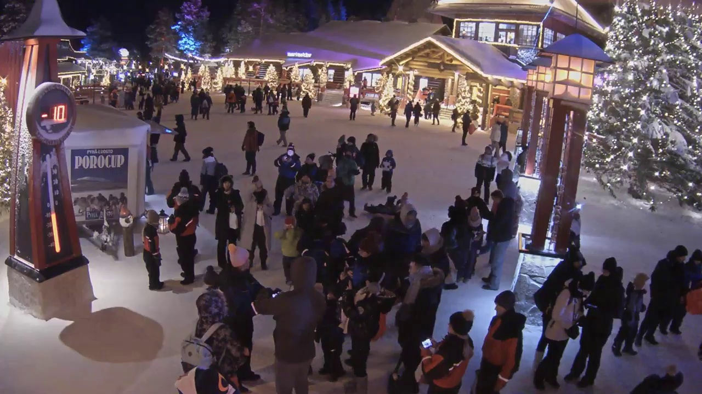

# Demo Scenario 2


<!-- WARNING: THIS FILE WAS AUTOGENERATED! DO NOT EDIT! -->

The goal of this scenario is to demonstrate our built-in tools for
integrating computer vision to GPT Function calling in a relevant use
case.

The scenario of this demo is a user wanting to test different vision
models and visualize their outputs through plotting. Without our
application, the user would need to manually set up and configure the
models. This process can be complex, requiring significant technical
expertise, time, and effort to test various models, handle compatibility
issues, and ensure smooth operation. This manual approach also lacks
scalability and replicability, as the workflow need to be re-implemented
for different systems or teams.

With our application, this entire process is simplified. Our built-in
tools allow the user to specify tasks in plain language, and GPT FC
handles the setup, selection, and coordination of the appropriate models
and reporting tools. Additionally, GPT FC enables real-time interactions
and allows flexible choices in building Machine learning pipelines. It
can also dynamically imports and integrates new tools, adapting easily
to evolving user needs.

For this demo, we will be using the Youtube Live feed
https://www.youtube.com/watch?v=Cp4RRAEgpeU at Santa Claus Village.

## Step 1 - Built-in `llmcam.vision` modules

For this demo, we will add some default built-in tools from
`llmcam.vision`. At this step, the main steps are:

- Import `llmcam.core` modules and `llmcam.vision` modules.  
- Set up initial `tools` list and add built-in tools from
  `llmcam.vision`.  
- Verify set up with GPT messages.

``` python
# Import all the base modules and vision modules
from llmcam.core.fc import *
from llmcam.core.fn_to_schema import *
from llmcam.vision.ytlive import *
from llmcam.vision.gpt4v import *
from llmcam.vision.yolo import *
from llmcam.vision.plotting import *
```

``` python
# Define the `tools` list with default built-in functions
tools = [function_schema(func, "llmcam_vision") for func in [
    capture_youtube_live_frame, 
    ask_gpt4v_about_image_file,
    detect_objects,
    plot_object
]]
```

``` python
# Start the conversation and verify the tools
messages = form_msgs([
    ("system", "You are a helpful system administrator. Use the supplied tools to help the user."),
    ("user", "What tools can you use?")
])
complete(messages, tools=tools)
print_msg(messages[-1])
```

    >> Assistant:
    I can use the following tools:  1. **capture_youtube_live_frame**: Capture a jpeg image from a
    YouTube Live stream and return the path to the saved image.  2. **ask_gpt4v_about_image_file**:
    Provide quantitative information about a given image file.  3. **detect_objects**: Detect objects in
    an image using the YOLO model.  4. **plot_object**: Generate a bar plot displaying the number of
    instances of a specified object detected in a list of images, using specified methods ("gpt" and
    "yolo").

## Step 2 - Test different vision models

Our built-in tools contain 2 models - YOLO object detection and GPT
model. Both these tools only need the image as their inputs. This image
can be retrieved from the Youtube Live with another built-in tool.

At this step, the main tasks include:

- Capture an image from Santa Clause Village with its link:
  https://www.youtube.com/watch?v=Cp4RRAEgpeU  
- Use GPT model to detect the number of people and basic information.  
- Use YOLO to detect the number of people and any other objects.

``` python
# Capture the live feed from Santa Claus Village
messages.append(form_msg(
    "user", 
    "Here is the live feed for Santa Claus Village https://www.youtube.com/watch?v=Cp4RRAEgpeU to capture. \
Tell me also the file path of the saved image."
))
complete(messages, tools=tools)
print_msg(messages[-1])
```

    [youtube] Extracting URL: https://www.youtube.com/watch?v=Cp4RRAEgpeU
    [youtube] Cp4RRAEgpeU: Downloading webpage
    [youtube] Cp4RRAEgpeU: Downloading ios player API JSON
    [youtube] Cp4RRAEgpeU: Downloading mweb player API JSON
    [youtube] Cp4RRAEgpeU: Downloading m3u8 information
    [youtube] Cp4RRAEgpeU: Downloading m3u8 information
    >> Assistant:
    The image from the Santa Claus Village live feed has been captured and saved at the following file
    path: `/home/nghivo/tinyMLaaS/llmcam/data/cap_2024.12.20_16:12:07_None.jpg`.

``` python
# Display the captured image
from IPython.display import Image
Image("/home/nghivo/tinyMLaaS/llmcam/data/cap_2024.12.20_16:12:07_None.jpg")
```



``` python
# Ask the GPT-4 Vision model about the image
messages.append(form_msg(
    "user", 
    "Use the GPT-4 Vision model to tell the number of people and briefly describe the image."
))
complete(messages, tools=tools)
print_msg(messages[-1])
```

    >> Assistant:
    The image captured from the Santa Claus Village live feed shows:  - **Number of People**:
    Approximately 50 people are present. - **Description**: The scene takes place at night with
    prominent artificial lighting illuminating the area. There are 3 buildings visible, ranging from 1
    to 2 stories in height. The atmosphere appears lively, possibly with people gathered for an event or
    simply enjoying the winter ambiance. Additionally, there are 5 trees adorned with lights, adding to
    the festive atmosphere. The temperature is around -10°C, and the sky is not visible in the image.

``` python
# Detect the objects in the image using YOLO
messages.append(form_msg(
    "user",
    "Use YOLO to detect the number of people in the image and any other objects \
in the image."
))
complete(messages, tools=tools)
print_msg(messages[-1])
```


    image 1/1 /home/nghivo/tinyMLaaS/llmcam/data/cap_2024.12.20_16:12:07_None.jpg: 384x640 16 persons, 72.2ms
    Speed: 7.0ms preprocess, 72.2ms inference, 223.1ms postprocess per image at shape (1, 3, 384, 640)
    >> Assistant:
    Using the YOLO model, the image contains:  - **Number of People**: 16  No other objects were
    detected in the image besides people.

``` python
# Display the detection image
Image("/home/nghivo/tinyMLaaS/llmcam/data/detection_cap_2024.12.20_16:12:07_None.jpg")
```


## Step 3 - Pipeline extension with plotting

We can further extend the comparison pipeline with any reporting tools
or monitoring utilities (demonstrated in demo scenario 3). In this demo,
we will use the built-in tool from `llmcam.vision.plotting` to create
bar plot between these two models.

At this step, the main tasks include:

- Capture another image to increase data volume in plots.  
- Plot the number of people with both models.

``` python
# Capture another image from the live feed
messages.append(form_msg(
    "user", 
    "Capture another image from the live feed."
))
complete(messages, tools=tools)
print_msg(messages[-1])
```

    [youtube] Extracting URL: https://www.youtube.com/watch?v=Cp4RRAEgpeU
    [youtube] Cp4RRAEgpeU: Downloading webpage
    [youtube] Cp4RRAEgpeU: Downloading ios player API JSON
    [youtube] Cp4RRAEgpeU: Downloading mweb player API JSON
    [youtube] Cp4RRAEgpeU: Downloading m3u8 information
    [youtube] Cp4RRAEgpeU: Downloading m3u8 information
    >> Assistant:
    Another image from the Santa Claus Village live feed has been captured and saved at the following
    file path: `/home/nghivo/tinyMLaaS/llmcam/data/cap_2024.12.20_16:12:23_None.jpg`.

``` python
# Plot the number of people in the captured images using both GPT-4 Vision and YOLO
messages.append(form_msg(
    "user",
    "Plot the number of people in these captured images using both methods \
 - GPT retrieval of basic information and YOLO object detection. \
Tell me the file path of the generated plot."
))
complete(messages, tools=tools)
print_msg(messages[-1])
```


    image 1/1 /home/nghivo/tinyMLaaS/llmcam/data/cap_2024.12.20_16:12:07_None.jpg: 384x640 16 persons, 10.4ms
    Speed: 2.2ms preprocess, 10.4ms inference, 1.7ms postprocess per image at shape (1, 3, 384, 640)

    image 1/1 /home/nghivo/tinyMLaaS/llmcam/data/cap_2024.12.20_16:12:23_None.jpg: 384x640 19 persons, 10.1ms
    Speed: 1.2ms preprocess, 10.1ms inference, 1.3ms postprocess per image at shape (1, 3, 384, 640)
    >> Assistant:
    The plot displaying the number of people detected in the captured images using both the GPT-4 Vision
    method and YOLO object detection has been generated. You can find the plot at the following file
    path: `/home/nghivo/tinyMLaaS/llmcam/data/484_object_count_plot.jpg`.

``` python
Image("/home/nghivo/tinyMLaaS/llmcam/data/484_object_count_plot.jpg")
```


## **CONVERSATION TRANSCRIPT**

``` python
print_msgs(messages)
```

    >> System:
    You are a helpful system administrator. Use the supplied tools to help the user.
    >> User:
    What tools can you use?
    >> Assistant:
    I can use the following tools:  1. **capture_youtube_live_frame**: Capture a jpeg image from a
    YouTube Live stream and return the path to the saved image.  2. **ask_gpt4v_about_image_file**:
    Provide quantitative information about a given image file.  3. **detect_objects**: Detect objects in
    an image using the YOLO model.  4. **plot_object**: Generate a bar plot displaying the number of
    instances of a specified object detected in a list of images, using specified methods ("gpt" and
    "yolo").
    >> User:
    Here is the live feed for Santa Claus Village https://www.youtube.com/watch?v=Cp4RRAEgpeU to
    capture. Tell me also the file path of the saved image.
    >> Assistant:
    The image from the Santa Claus Village live feed has been captured and saved at the following file
    path: `/home/nghivo/tinyMLaaS/llmcam/data/cap_2024.12.20_16:12:07_None.jpg`.
    >> User:
    Use the GPT-4 Vision model to tell the number of people and briefly describe the image.
    >> Assistant:
    The image captured from the Santa Claus Village live feed shows:  - **Number of People**:
    Approximately 50 people are present. - **Description**: The scene takes place at night with
    prominent artificial lighting illuminating the area. There are 3 buildings visible, ranging from 1
    to 2 stories in height. The atmosphere appears lively, possibly with people gathered for an event or
    simply enjoying the winter ambiance. Additionally, there are 5 trees adorned with lights, adding to
    the festive atmosphere. The temperature is around -10°C, and the sky is not visible in the image.
    >> User:
    Use YOLO to detect the number of people in the image and any other objects in the image.
    >> Assistant:
    Using the YOLO model, the image contains:  - **Number of People**: 16  No other objects were
    detected in the image besides people.
    >> User:
    Capture another image from the live feed.
    >> Assistant:
    Another image from the Santa Claus Village live feed has been captured and saved at the following
    file path: `/home/nghivo/tinyMLaaS/llmcam/data/cap_2024.12.20_16:12:23_None.jpg`.
    >> User:
    Plot the number of people in these captured images using both methods  - GPT retrieval of basic
    information and YOLO object detection. Tell me the file path of the generated plot.
    >> Assistant:
    The plot displaying the number of people detected in the captured images using both the GPT-4 Vision
    method and YOLO object detection has been generated. You can find the plot at the following file
    path: `/home/nghivo/tinyMLaaS/llmcam/data/484_object_count_plot.jpg`.
