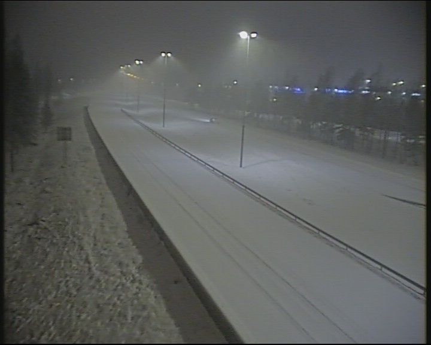

# File Manager


<!-- WARNING: THIS FILE WAS AUTOGENERATED! DO NOT EDIT! -->

## Download files

Our application occasionally needs to download files with their public
URL. Therefore, an utility of our local file manager is downloading
online files.

------------------------------------------------------------------------

<a
href="https://github.com/ninjalabo/llmcam/blob/main/llmcam/utils/file_manager.py#L16"
target="_blank" style="float:right; font-size:smaller">source</a>

### download_file

>  download_file (url:str, save_path:Optional[str]=None)

*Download a file from a give `url`*

<table>
<thead>
<tr>
<th></th>
<th><strong>Type</strong></th>
<th><strong>Default</strong></th>
<th><strong>Details</strong></th>
</tr>
</thead>
<tbody>
<tr>
<td>url</td>
<td>str</td>
<td></td>
<td>URL to download</td>
</tr>
<tr>
<td>save_path</td>
<td>Optional</td>
<td>None</td>
<td>File name to save</td>
</tr>
</tbody>
</table>

Example usage with downloading file from DigiTraffic weather camera:

``` python
from IPython.display import Image
file = os.getenv("LLMCAM_DATA", "../data") + "/C0150200.jpg"

download_file("https://weathercam.digitraffic.fi/C0150200.jpg", file)
Image(file)
```



## List local files

File manager should be able to list downloaded / generated data files
stored in local data directory. There are four types of files that are
used in our application:

- **Image files**: Images captured from Youtube Live capturing or
  weather cameras. The file-naming scheme is
  `cap_%Y.%m.%d_%H:%M:%S_<place name>.jpg`.  
- **Detection files**: Images with bounding boxes generated by
  Object-detection models. File names should start with `detection_`.  
- **Demo files**: Parking lot frames. File names should start with
  `demo3_`.  
- **Plot files**: Plots generated by GPT Function calling. File names
  should end with `plot`.

``` python
data_path = os.getenv("LLMCAM_DATA", "../data")
files = sorted(glob.glob(f"{data_path}/cap_*.jpg"))
```

``` python
len(files), files[:3], type(files[0])
```

    (561,
     ['/home/nghivo/tinyMLaaS/llmcam/data/cap_2024.09.28_15:59:06_Presidentinlinna.jpg',
      '/home/nghivo/tinyMLaaS/llmcam/data/cap_2024.09.28_16:00:11_Presidentinlinna.jpg',
      '/home/nghivo/tinyMLaaS/llmcam/data/cap_2024.09.28_16:01:16_Etelasatama.jpg'],
     str)

------------------------------------------------------------------------

<a
href="https://github.com/ninjalabo/llmcam/blob/main/llmcam/utils/file_manager.py#L31"
target="_blank" style="float:right; font-size:smaller">source</a>

### list_image_files

>  list_image_files ()

*List all captured image files. file naming scheme is
“cap\_%Y.%m.%d\_%H:%M:%S\_<place name>.jpg”*

------------------------------------------------------------------------

<a
href="https://github.com/ninjalabo/llmcam/blob/main/llmcam/utils/file_manager.py#L38"
target="_blank" style="float:right; font-size:smaller">source</a>

### list_detection_files

>  list_detection_files ()

*List all detection images. File name starts with detection\_*

------------------------------------------------------------------------

<a
href="https://github.com/ninjalabo/llmcam/blob/main/llmcam/utils/file_manager.py#L43"
target="_blank" style="float:right; font-size:smaller">source</a>

### list_demo3_files

>  list_demo3_files ()

*List all parking lot frames. File name starts with demo3\_*

------------------------------------------------------------------------

<a
href="https://github.com/ninjalabo/llmcam/blob/main/llmcam/utils/file_manager.py#L48"
target="_blank" style="float:right; font-size:smaller">source</a>

### list_plot_files

>  list_plot_files ()

*List all plots. File name ends with plot*

Example usage:

``` python
images = list_image_files().split("\n")
detections = list_detection_files().split("\n")
plots = list_plot_files().split("\n")

print("Example image file:", images[0])
print("Example detection file:", detections[0])
print("Example plot file:", plots[0])
```

    Example image file: /home/nghivo/tinyMLaaS/llmcam/data/cap_2024.11.20_13:21:57_Porvoo_C0150200.jpg
    Example detection file: /home/nghivo/tinyMLaaS/llmcam/data/detection_cap_2024.12.11_13:59:40_santaclausvillage.jpg
    Example plot file: /home/nghivo/tinyMLaaS/llmcam/data/118_object_count_plot.jpg

## Simulated GPT workflow

Test integrating with our current GPT framework:

``` python
from llmcam.core.fc import *
from llmcam.core.fn_to_schema import function_schema

tools = [
    function_schema(download_file, "Download file"),
    function_schema(list_image_files, "List image files")
]
messages = form_msgs([
    ("system", "You are a helpful system administrator. Use the supplied tools to assist the user."),
    ("user", "Download a file from https://weathercam.digitraffic.fi/C0150200.jpg."),
])
complete(messages, tools=tools)
print_msgs(messages)
```

    >> System:
    You are a helpful system administrator. Use the supplied tools to assist the user.
    >> User:
    Download a file from https://weathercam.digitraffic.fi/C0150200.jpg.
    >> Assistant:
    The file has been successfully downloaded from [this
    link](https://weathercam.digitraffic.fi/C0150200.jpg) and saved as "C0150200.jpg".

``` python
from IPython.display import Image
Image("C0150200.jpg")
```


``` python
messages.append(form_msg("user", "List all captured images at Kauppatori in September."))
complete(messages, tools=tools)
print_msgs(messages)
```

    >> System:
    You are a helpful system administrator. Use the supplied tools to assist the user.
    >> User:
    Download a file from https://weathercam.digitraffic.fi/C0150200.jpg.
    >> Assistant:
    The file has been successfully downloaded from [this
    link](https://weathercam.digitraffic.fi/C0150200.jpg) and saved as "C0150200.jpg".
    >> User:
    List all captured images at Kauppatori in September.
    >> Assistant:
    Here are the captured images at Kauppatori in September:  1. **September 28th:**    - [cap_2024.09.2
    8_20:07:56_Kauppatori.jpg](sandbox:/home/nghivo/tinyMLaaS/llmcam/data/cap_2024.09.28_20:07:56_Kauppa
    tori.jpg)    - [cap_2024.09.28_20:23:16_Kauppatori.jpg](sandbox:/home/nghivo/tinyMLaaS/llmcam/data/c
    ap_2024.09.28_20:23:16_Kauppatori.jpg)  2. **September 29th:**    - [cap_2024.09.29_19:20:31_Kauppat
    ori.jpg](sandbox:/home/nghivo/tinyMLaaS/llmcam/data/cap_2024.09.29_19:20:31_Kauppatori.jpg)    - [ca
    p_2024.09.29_19:21:31_Kauppatori.jpg](sandbox:/home/nghivo/tinyMLaaS/llmcam/data/cap_2024.09.29_19:2
    1:31_Kauppatori.jpg)  3. **September 30th:**    - [cap_2024.09.30_09:25:01_Kauppatori.jpg](sandbox:/
    home/nghivo/tinyMLaaS/llmcam/data/cap_2024.09.30_09:25:01_Kauppatori.jpg)    - [cap_2024.09.30_09:21
    :21_Kauppatori.jpg](sandbox:/home/nghivo/tinyMLaaS/llmcam/data/cap_2024.09.30_09:21:21_Kauppatori.jp
    g)    - [cap_2024.09.30_09:40:46_Kauppatori.jpg](sandbox:/home/nghivo/tinyMLaaS/llmcam/data/cap_2024
    .09.30_09:40:46_Kauppatori.jpg)  These files are available from the listed captured dates in
    September.

``` python
messages.append(form_msg("user", "List all locations in the captured images."))
complete(messages, tools=tools)
print_msgs(messages)
```

    >> System:
    You are a helpful system administrator. Use the supplied tools to assist the user.
    >> User:
    Download a file from https://weathercam.digitraffic.fi/C0150200.jpg.
    >> Assistant:
    The file has been successfully downloaded from [this
    link](https://weathercam.digitraffic.fi/C0150200.jpg) and saved as "C0150200.jpg".
    >> User:
    List all captured images at Kauppatori in September.
    >> Assistant:
    Here are the captured images at Kauppatori in September:  1. **September 28th:**    - [cap_2024.09.2
    8_20:07:56_Kauppatori.jpg](sandbox:/home/nghivo/tinyMLaaS/llmcam/data/cap_2024.09.28_20:07:56_Kauppa
    tori.jpg)    - [cap_2024.09.28_20:23:16_Kauppatori.jpg](sandbox:/home/nghivo/tinyMLaaS/llmcam/data/c
    ap_2024.09.28_20:23:16_Kauppatori.jpg)  2. **September 29th:**    - [cap_2024.09.29_19:20:31_Kauppat
    ori.jpg](sandbox:/home/nghivo/tinyMLaaS/llmcam/data/cap_2024.09.29_19:20:31_Kauppatori.jpg)    - [ca
    p_2024.09.29_19:21:31_Kauppatori.jpg](sandbox:/home/nghivo/tinyMLaaS/llmcam/data/cap_2024.09.29_19:2
    1:31_Kauppatori.jpg)  3. **September 30th:**    - [cap_2024.09.30_09:25:01_Kauppatori.jpg](sandbox:/
    home/nghivo/tinyMLaaS/llmcam/data/cap_2024.09.30_09:25:01_Kauppatori.jpg)    - [cap_2024.09.30_09:21
    :21_Kauppatori.jpg](sandbox:/home/nghivo/tinyMLaaS/llmcam/data/cap_2024.09.30_09:21:21_Kauppatori.jp
    g)    - [cap_2024.09.30_09:40:46_Kauppatori.jpg](sandbox:/home/nghivo/tinyMLaaS/llmcam/data/cap_2024
    .09.30_09:40:46_Kauppatori.jpg)  These files are available from the listed captured dates in
    September.
    >> User:
    List all locations in the captured images.
    >> Assistant:
    Here are all the locations captured in the images:  1. **Porvoo** 2. **Valkosaari** 3.
    **Tuomiokirkko** 4. **Kauppatori** 5. **Torni** 6. **Presidentinlinna** 7. **Etelasatama** 8.
    **Olympiaterminaali** 9. **None** 10. **Unclear** 11. **Santa Claus Village** 12. **Kehä 1 Itään**
    13. **Kuopioon**  These are the distinct locations found based on the captured images' file names.
