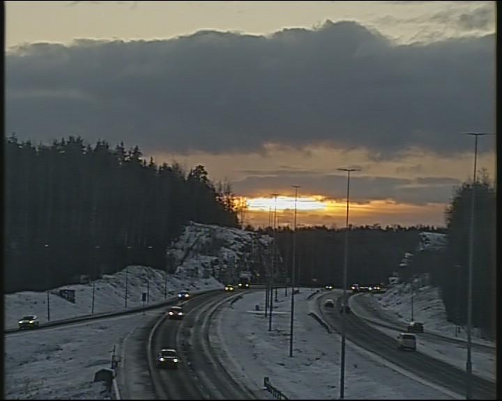
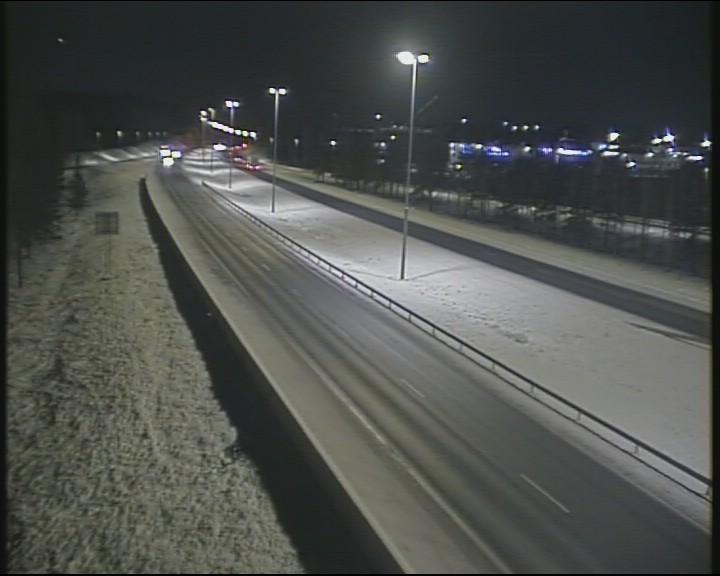

# DTCam


<!-- WARNING: THIS FILE WAS AUTOGENERATED! DO NOT EDIT! -->

This utility focuses on capturing images from a weathercam provided by
Road DigiTraffic based on its station location.

Road DigiTraffic provides data about public cameras from their
weathercam stations, which includes information about its region name.
Therefore, we can filter stations by their region name and find specific
stations in a certain region (e.g., Helsinki, Porvoo, …).

## Camera address book

First, we can build an address book of camera installed address, and
image capture url from Road DigiTraffic. The format of this address book
can be a list of JSON-formatted data objects:

    [
        {
            "address": <camera installed location>,
            "url": <capture image url>,
        },
        {
            "address": <camera installed location>,
            "url": <capture image url>,
        },
        ....
    ]

------------------------------------------------------------------------

<a
href="https://github.com/ninjalabo/llmcam/blob/main/llmcam/vision/dtcam.py#L23"
target="_blank" style="float:right; font-size:smaller">source</a>

### build_address_book

>  build_address_book (stations_url:str)

------------------------------------------------------------------------

<a
href="https://github.com/ninjalabo/llmcam/blob/main/llmcam/vision/dtcam.py#L44"
target="_blank" style="float:right; font-size:smaller">source</a>

### address_book

>  address_book (stations_url:str='https://tie.digitraffic.fi/api/weathercam
>                    /v1/stations', force_update=False)

*Get an address book \[{“address”:<camera installed address>,
“url”:<image capture url>}\]*

------------------------------------------------------------------------

<a
href="https://github.com/ninjalabo/llmcam/blob/main/llmcam/vision/dtcam.py#L58"
target="_blank" style="float:right; font-size:smaller">source</a>

### camera_address_book

>  camera_address_book (stations_url:Optional[str]='https://tie.digitraffic.
>                           fi/api/weathercam/v1/stations',
>                           update:Optional[bool]=False)

*Get weather camera location addressbook of
`camera location`:`image url`. You can get an capture of camera from
this url*

<table>
<colgroup>
<col style="width: 6%" />
<col style="width: 25%" />
<col style="width: 34%" />
<col style="width: 34%" />
</colgroup>
<thead>
<tr>
<th></th>
<th><strong>Type</strong></th>
<th><strong>Default</strong></th>
<th><strong>Details</strong></th>
</tr>
</thead>
<tbody>
<tr>
<td>stations_url</td>
<td>Optional</td>
<td>https://tie.digitraffic.fi/api/weathercam/v1/stations</td>
<td>Weather Camera URL</td>
</tr>
<tr>
<td>update</td>
<td>Optional</td>
<td>False</td>
<td>Update addressbook forcely</td>
</tr>
<tr>
<td><strong>Returns</strong></td>
<td><strong>str</strong></td>
<td></td>
<td><strong>List of
<code>"camera location"</code>:<code>"image url"</code></strong></td>
</tr>
</tbody>
</table>

Example address book from Road DigiTraffic:

``` python
addresses = camera_address_book()
json.loads(addresses)[0]
```

    {'address': 'Porvoo,Tie 7 Porvoo, Harabacka,Porvoo,Uusimaa',
     'url': 'https://weathercam.digitraffic.fi/C0150200.jpg'}

## Weathercam image capturing

Based on possible weathercam stations, we extract images from these
cameras by requesting the corresponding URL:

------------------------------------------------------------------------

<a
href="https://github.com/ninjalabo/llmcam/blob/main/llmcam/vision/dtcam.py#L67"
target="_blank" style="float:right; font-size:smaller">source</a>

### stations

>  stations (key:str)

*“Get all weather station including `key` word*

Example with finding stations in Porvoo:

``` python
Porvoos = stations("Porvoo")
Porvoos[0]
```

    {'type': 'Feature',
     'id': 'C01502',
     'geometry': {'type': 'Point', 'coordinates': [25.616391, 60.390238, 0.0]},
     'properties': {'id': 'C01502',
      'name': 'vt7_Porvoo_Harabacka',
      'collectionStatus': 'GATHERING',
      'state': None,
      'dataUpdatedTime': '2024-12-12T03:26:57Z',
      'presets': [{'id': 'C0150200', 'inCollection': True}]}}

For DigiTraffic, the image from a weather camera can be retrieved with a
weathercam URL using the
[`presets`](https://ninjalabo.github.io/llmcam/vision/dtcam.html#presets)
data:

------------------------------------------------------------------------

<a
href="https://github.com/ninjalabo/llmcam/blob/main/llmcam/vision/dtcam.py#L78"
target="_blank" style="float:right; font-size:smaller">source</a>

### presets

>  presets (station:dict)

*Get all presets at a given weather station*

``` python
preset = presets(Porvoos[0])[0]
imageUrl = preset['imageUrl']
imageUrl
```

    'https://weathercam.digitraffic.fi/C0150200.jpg'

Download and save this image to local disk:

------------------------------------------------------------------------

<a
href="https://github.com/ninjalabo/llmcam/blob/main/llmcam/vision/dtcam.py#L89"
target="_blank" style="float:right; font-size:smaller">source</a>

### capture

>  capture (preset:dict)

*Capture image at a given preset location in a Weather station, and
return an image path*

``` python
hdr, path = capture(preset)
hdr
```

    {'Content-Type': 'image/jpeg', 'Content-Length': '66682', 'Connection': 'keep-alive', 'x-amz-id-2': 'e1nXLX4h6A1+r45u0fdlv7R44L3NqThwbK0/xJ7cUHnPUzkR6z4GhW5s0HhjppQttrBA0mLj+DoGPEfuI5ARaQ==', 'x-amz-request-id': '7YJ7D76VBEJA18S2', 'last-modified': 'Thu, 12 Dec 2024 13:03:04 GMT', 'x-amz-expiration': 'expiry-date="Sat, 14 Dec 2024 00:00:00 GMT", rule-id="Delete versions and current images after 24h"', 'x-amz-server-side-encryption': 'AES256', 'X-Amz-Meta-Last-Modified': 'Thu, 12 Dec 2024 13:03:04 GMT', 'x-amz-version-id': 'MbujShinwFlbCASbDJ4XE957WpwwBYT4', 'Accept-Ranges': 'bytes', 'Server': 'AmazonS3', 'Date': 'Thu, 12 Dec 2024 13:10:19 GMT', 'ETag': '"1c38821750ddec3363436dcd1077eb83"', 'Vary': 'Accept-Encoding', 'X-Cache': 'Hit from cloudfront', 'Via': '1.1 95ad0c949c0fe7e97075c6690b8574aa.cloudfront.net (CloudFront)', 'X-Amz-Cf-Pop': 'HEL51-P1', 'Alt-Svc': 'h3=":443"; ma=86400', 'X-Amz-Cf-Id': 'p4oSYL7h9m8R9Xua8kSJe59PlJJuqITUAx_V5e9urJ3GJSoAzOEu_w==', 'Age': '54'}

``` python
display(Image.open(path))
```



We can all previous utilities and implement a function that capture
images based on location keyword:

------------------------------------------------------------------------

<a
href="https://github.com/ninjalabo/llmcam/blob/main/llmcam/vision/dtcam.py#L107"
target="_blank" style="float:right; font-size:smaller">source</a>

### cap

>  cap (key:str='Porvoo')

*Capture an image at specified location, save it, and return its path*

<table>
<thead>
<tr>
<th></th>
<th><strong>Type</strong></th>
<th><strong>Default</strong></th>
<th><strong>Details</strong></th>
</tr>
</thead>
<tbody>
<tr>
<td>key</td>
<td>str</td>
<td>Porvoo</td>
<td>Location keyword</td>
</tr>
<tr>
<td><strong>Returns</strong></td>
<td><strong>str</strong></td>
<td></td>
<td><strong>Image path</strong></td>
</tr>
</tbody>
</table>

Test capturing an image of Porvoo:

``` python
path = cap("Porvoo")
display(Image.open(path))
```



## Simulated GPT workflow

This section tests integrating with our current GPT framework. This
function can be used in combination with previous functions in the
`vision` module:

``` python
from llmcam.core.fc import *
from llmcam.core.fn_to_schema import function_schema
from llmcam.vision.ytlive import capture_youtube_live_frame
from llmcam.vision.gpt4v import ask_gpt4v_about_image_file
from llmcam.vision.yolo import detect_objects

tools = [
    function_schema(capture_youtube_live_frame, "Youtube Live Capture"),
    function_schema(ask_gpt4v_about_image_file, "GPT4 Vision"),
    function_schema(detect_objects, "YOLO Object Detection"),
    function_schema(camera_address_book, "Weather Camera Address Book"),
    function_schema(cap, "Weather Station Capture")
]
messages = form_msgs([
    ("system", "You are a helpful system administrator. Use the supplied tools to assist the user."),
    ("user", "Name some locations to capture weather station images from the default address book."),
])
complete(messages, tools=tools)
print_msgs(messages)
```

    >> System:
    You are a helpful system administrator. Use the supplied tools to assist the user.
    >> User:
    Name some locations to capture weather station images from the default address book.
    >> Assistant:
    Here are some locations from the default weather camera address book where you can capture images:
    1. Porvoo, Uusimaa - [Link](https://weathercam.digitraffic.fi/C0150200.jpg) 2. Inkoo, Uusimaa -
    [Link](https://weathercam.digitraffic.fi/C0150301.jpg) 3. Hanko, Uusimaa -
    [Link](https://weathercam.digitraffic.fi/C0150302.jpg) 4. Karkkila, Uusimaa -
    [Link](https://weathercam.digitraffic.fi/C0150401.jpg) 5. Helsinki, Uusimaa -
    [Link](https://weathercam.digitraffic.fi/C0150402.jpg) 6. Lohja, Uusimaa -
    [Link](https://weathercam.digitraffic.fi/C0150601.jpg) 7. Hanko, Uusimaa -
    [Link](https://weathercam.digitraffic.fi/C0150701.jpg) 8. Mäntsälä, Uusimaa -
    [Link](https://weathercam.digitraffic.fi/C0150801.jpg) 9. Hyvinkää, Uusimaa -
    [Link](https://weathercam.digitraffic.fi/C0150901.jpg) 10. Vantaa, Uusimaa -
    [Link](https://weathercam.digitraffic.fi/C0153201.jpg)  These links provide current weather images
    from various locations across Finland.

``` python
# Continue the conversation and ask the user about the image
messages.append(form_msg("user", "Capture a weather station image from Helsinki and tell me some basic information about it."))
complete(messages, tools=tools)
print_msgs(messages)
```

    >> System:
    You are a helpful system administrator. Use the supplied tools to assist the user.
    >> User:
    Name some locations to capture weather station images from the default address book.
    >> Assistant:
    Here are some locations from the default weather camera address book where you can capture images:
    1. Porvoo, Uusimaa - [Link](https://weathercam.digitraffic.fi/C0150200.jpg) 2. Inkoo, Uusimaa -
    [Link](https://weathercam.digitraffic.fi/C0150301.jpg) 3. Hanko, Uusimaa -
    [Link](https://weathercam.digitraffic.fi/C0150302.jpg) 4. Karkkila, Uusimaa -
    [Link](https://weathercam.digitraffic.fi/C0150401.jpg) 5. Helsinki, Uusimaa -
    [Link](https://weathercam.digitraffic.fi/C0150402.jpg) 6. Lohja, Uusimaa -
    [Link](https://weathercam.digitraffic.fi/C0150601.jpg) 7. Hanko, Uusimaa -
    [Link](https://weathercam.digitraffic.fi/C0150701.jpg) 8. Mäntsälä, Uusimaa -
    [Link](https://weathercam.digitraffic.fi/C0150801.jpg) 9. Hyvinkää, Uusimaa -
    [Link](https://weathercam.digitraffic.fi/C0150901.jpg) 10. Vantaa, Uusimaa -
    [Link](https://weathercam.digitraffic.fi/C0153201.jpg)  These links provide current weather images
    from various locations across Finland.
    >> User:
    Capture a weather station image from Helsinki and tell me some basic information about it.
    >> Assistant:
    I captured an image from a weather station in Helsinki at the location "Tie 101 Helsinki, Pakila,"
    specifically at Kehä 1 Itään. Here are some basic details about the image:  - **Dimensions:** 1280 x
    720 - **Time of Day:** Afternoon - **Visibility:** Clear - **Sky Light Conditions:** Daylight -
    **Number of Cars:** 10 - **Street Lights:** 5 - **Buildings:** No buildings visible - **Artificial
    Lighting:** Minimal - **Waterbodies Visible:** No  The image shows a well-lit area with clear
    visibility, and there are no people, trucks, boats, or available parking spaces visible.

``` python
# Continue the conversation and detect objects in the image
messages.append(form_msg("user", "Can you detect what objects are captured in this image?"))
complete(messages, tools=tools)
print_msgs(messages)
```


    image 1/1 /home/nghivo/tinyMLaaS/llmcam/data/cap_2024.12.12_13:06:53_Kehä 1 Itään_C0151301.jpg: 384x640 7 cars, 54.9ms
    Speed: 5.5ms preprocess, 54.9ms inference, 221.6ms postprocess per image at shape (1, 3, 384, 640)
    >> System:
    You are a helpful system administrator. Use the supplied tools to assist the user.
    >> User:
    Name some locations to capture weather station images from the default address book.
    >> Assistant:
    Here are some locations from the default weather camera address book where you can capture images:
    1. Porvoo, Uusimaa - [Link](https://weathercam.digitraffic.fi/C0150200.jpg) 2. Inkoo, Uusimaa -
    [Link](https://weathercam.digitraffic.fi/C0150301.jpg) 3. Hanko, Uusimaa -
    [Link](https://weathercam.digitraffic.fi/C0150302.jpg) 4. Karkkila, Uusimaa -
    [Link](https://weathercam.digitraffic.fi/C0150401.jpg) 5. Helsinki, Uusimaa -
    [Link](https://weathercam.digitraffic.fi/C0150402.jpg) 6. Lohja, Uusimaa -
    [Link](https://weathercam.digitraffic.fi/C0150601.jpg) 7. Hanko, Uusimaa -
    [Link](https://weathercam.digitraffic.fi/C0150701.jpg) 8. Mäntsälä, Uusimaa -
    [Link](https://weathercam.digitraffic.fi/C0150801.jpg) 9. Hyvinkää, Uusimaa -
    [Link](https://weathercam.digitraffic.fi/C0150901.jpg) 10. Vantaa, Uusimaa -
    [Link](https://weathercam.digitraffic.fi/C0153201.jpg)  These links provide current weather images
    from various locations across Finland.
    >> User:
    Capture a weather station image from Helsinki and tell me some basic information about it.
    >> Assistant:
    I captured an image from a weather station in Helsinki at the location "Tie 101 Helsinki, Pakila,"
    specifically at Kehä 1 Itään. Here are some basic details about the image:  - **Dimensions:** 1280 x
    720 - **Time of Day:** Afternoon - **Visibility:** Clear - **Sky Light Conditions:** Daylight -
    **Number of Cars:** 10 - **Street Lights:** 5 - **Buildings:** No buildings visible - **Artificial
    Lighting:** Minimal - **Waterbodies Visible:** No  The image shows a well-lit area with clear
    visibility, and there are no people, trucks, boats, or available parking spaces visible.
    >> User:
    Can you detect what objects are captured in this image?
    >> Assistant:
    The image captured at Helsinki's weather station contains 7 cars. No other objects were detected in
    the image.
