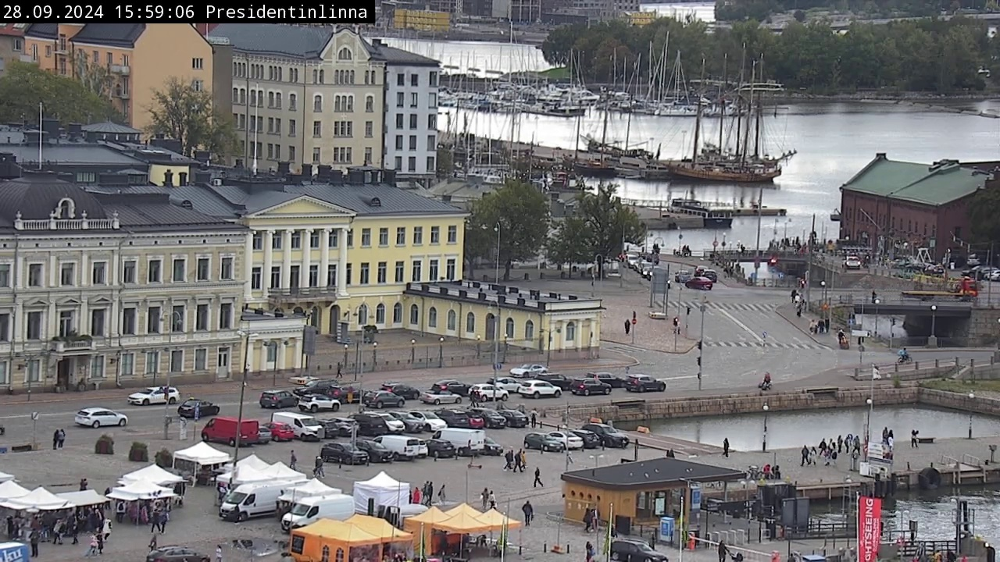
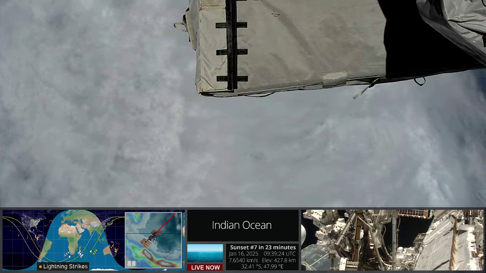

# Ask GPT-4v


<!-- WARNING: THIS FILE WAS AUTOGENERATED! DO NOT EDIT! -->

## Process images with GPT

A simple approach to process image with GPT is to encode image as base64
string and ask about its information. Starting with some local images:

``` python
import os
from pathlib import Path

data_path = Path(os.getenv("LLMCAM_DATA", "../data")).absolute()
files = sorted(glob.glob(f"{data_path}/cap_*.jpg"))
len(files), files[:9]
```

    (640,
     ['/home/nghivo/tinyMLaaS/llmcam/data/cap_2024.09.28_15:59:06_Presidentinlinna.jpg',
      '/home/nghivo/tinyMLaaS/llmcam/data/cap_2024.09.28_16:00:11_Presidentinlinna.jpg',
      '/home/nghivo/tinyMLaaS/llmcam/data/cap_2024.09.28_16:01:16_Etelasatama.jpg',
      '/home/nghivo/tinyMLaaS/llmcam/data/cap_2024.09.28_16:02:21_Etelasatama.jpg',
      '/home/nghivo/tinyMLaaS/llmcam/data/cap_2024.09.28_16:05:31_Olympiaterminaali.jpg',
      '/home/nghivo/tinyMLaaS/llmcam/data/cap_2024.09.28_16:06:36_Olympiaterminaali.jpg',
      '/home/nghivo/tinyMLaaS/llmcam/data/cap_2024.09.28_16:07:41_Torni.jpg',
      '/home/nghivo/tinyMLaaS/llmcam/data/cap_2024.09.28_16:09:51_Tuomiokirkko.jpg',
      '/home/nghivo/tinyMLaaS/llmcam/data/cap_2024.09.28_16:15:11_Presidentinlinna.jpg'])

``` python
Image(files[0])
```



------------------------------------------------------------------------

<a
href="https://github.com/ninjalabo/llmcam/blob/main/llmcam/vision/gpt4v.py#L17"
target="_blank" style="float:right; font-size:smaller">source</a>

### encode_image

>  encode_image (fname:str)

*Encode an image file as base64 string*

Example of encoding:

``` python
base64_image = encode_image(files[0])
base64_image[:9]
```

    '/9j/4AAQS'

With the encoded image, we can use OpenAI API to intiate a conversation
asking about the image. We can also specify the format of outputs:

``` python
response = openai.chat.completions.create(
  model="gpt-4o",
  messages=[{
        "role": "user",
        "content": [
            {"type": "text", "text": question,},
            {
                "type": "image_url",
                "image_url": {"url": f"data:image/jpeg;base64,{encode_image(files[0])}", "detail":"high",},
            },
        ],
    }],
  max_tokens=300,
)
response.choices[0].message.content
```

    '```json\n{\n    "timestamp": "2024-09-28T15:59:06",\n    "location": "Presidentinlinna",\n    "dimensions": "1280 x 720",\n    "building": 12,\n    "buildings_height_range": "3-7 stories",\n    "car": 30,\n    "truck": 3,\n    "boat": 6,\n    "available_parking_space": 5,\n    "street_lights": 15,\n    "person": 50,\n    "time_of_day": "afternoon",\n    "artificial_lighting": "minimal",\n    "visibility_clear": true,\n    "sky_visible": true,\n    "sky_light_conditions": "daylight",\n    "waterbodies_visible": true,\n    "waterbodies_type": "harbor"\n}\n```'

It is clear that we need some extra processing steps to convert the
JSON-formatted data in strings into Python dictionary.

``` python
def info(response):
    txt = json.loads(response.json())['choices'][0]['message']['content']
    data = json.loads(txt.replace('```json\n', "").replace('\n```', ""))
    return data
```

``` python
info(response)
```

    /tmp/ipykernel_17475/2561472427.py:3: PydanticDeprecatedSince20: The `json` method is deprecated; use `model_dump_json` instead. Deprecated in Pydantic V2.0 to be removed in V3.0. See Pydantic V2 Migration Guide at https://errors.pydantic.dev/2.10/migration/
      txt = json.loads(response.json())['choices'][0]['message']['content']

    {'timestamp': '2024-09-28T15:59:06',
     'location': 'Presidentinlinna',
     'dimensions': '1280 x 720',
     'building': 12,
     'buildings_height_range': '3-7 stories',
     'car': 30,
     'truck': 3,
     'boat': 6,
     'available_parking_space': 5,
     'street_lights': 15,
     'person': 50,
     'time_of_day': 'afternoon',
     'artificial_lighting': 'minimal',
     'visibility_clear': True,
     'sky_visible': True,
     'sky_light_conditions': 'daylight',
     'waterbodies_visible': True,
     'waterbodies_type': 'harbor'}

## Response format

Instead of manual transformation, we can try applying GPT structured
output to provide a guideline and some suggestions for ouputs. In our
application, we have tested with images from city cameras and images
from satellite, both of which vastly differ in content with one another.
Hence, it might be more relevant if we provide different output formats
and field suggestions for GPT separately for each type of image.

City landscape output:

Satellite information output:

``` python
satellite_img = "/home/nghivo/tinyMLaaS/llmcam/data/cap_2025.01.16_11:39:47_satellite.jpg"
Image(satellite_img)
```



Lastly, we combine these formats and previous operations into a single
function, with an indicator directing which output format to select:

------------------------------------------------------------------------

<a
href="https://github.com/ninjalabo/llmcam/blob/main/llmcam/vision/gpt4v.py#L233"
target="_blank" style="float:right; font-size:smaller">source</a>

### ask_gpt4v_about_image_file

>  ask_gpt4v_about_image_file (path:str, image_type:str='city')

*Tell all about quantitative information from a given image file*

<table>
<colgroup>
<col style="width: 6%" />
<col style="width: 25%" />
<col style="width: 34%" />
<col style="width: 34%" />
</colgroup>
<thead>
<tr>
<th></th>
<th><strong>Type</strong></th>
<th><strong>Default</strong></th>
<th><strong>Details</strong></th>
</tr>
</thead>
<tbody>
<tr>
<td>path</td>
<td>str</td>
<td></td>
<td>Path to the image file</td>
</tr>
<tr>
<td>image_type</td>
<td>str</td>
<td>city</td>
<td>Type of image: “city” or “satellite”, default is “city”</td>
</tr>
<tr>
<td><strong>Returns</strong></td>
<td><strong>str</strong></td>
<td></td>
<td><strong>JSON string with quantitative information</strong></td>
</tr>
</tbody>
</table>

Test with the previous data files:

``` python
json.loads(ask_gpt4v_about_image_file(files[0]))
```

    {'timestamp': '2024-09-28T15:59:06',
     'location': 'Presidentinlinna',
     'dimensions': '720x1280',
     'building': 10,
     'buildings_height_range': '3-5 stories',
     'car': 30,
     'truck': 3,
     'boat': 6,
     'available_parking_space': 5,
     'street_lights': 6,
     'person': 40,
     'time_of_day': 'afternoon',
     'artificial_lighting': 'low',
     'visibility_clear': True,
     'sky_visible': True,
     'sky_light_conditions': 'overcast',
     'waterbodies_visible': True,
     'waterbodies_type': 'harbor'}

``` python
json.loads(ask_gpt4v_about_image_file(satellite_img, "satellite"))
```

    {'timestamp': '2025-01-16T09:39:24Z',
     'location': 'Indian Ocean',
     'latitude': -32.41,
     'longitude': 47.99,
     'image_dimensions': '1280x720',
     'satellite_name': 'International Space Station',
     'sensor_type': 'Optical',
     'cloud_cover_percentage': 90,
     'land_cover_types': ['ocean'],
     'waterbodies_detected': True,
     'waterbodies_type': 'Ocean',
     'urban_areas_detected': False,
     'lightning_detected': False,
     'thermal_anomalies_detected': False,
     'nighttime_imaging': False,
     'mins_to_sunset': 23,
     'satellite_speed_kms': '7.6540',
     'satellite_altitude_km': '427.8'}

## Simulated GPT workflow

This section tests integrating with our current GPT framework. This
function can be used in combination with `ytlive` module:

``` python
from llmcam.core.fc import *
from llmcam.core.fn_to_schema import function_schema
from llmcam.vision.ytlive import *

tools = [
    function_schema(capture_youtube_live_frame, "Youtube Live Capture"),
    function_schema(select_youtube_live_url, "Youtube Live URL"),
    function_schema(ask_gpt4v_about_image_file, "GPT4 Vision"),
]
messages = form_msgs([
    ("system", "You are a helpful system administrator. Use the supplied tools to assist the user."),
    ("user", "Hi, can you capture a YouTube Live? Use the default link.")
])
complete(messages, tools=tools)
print_msgs(messages)
```

    [youtube] Extracting URL: https://www.youtube.com/watch?v=LMZQ7eFhm58
    [youtube] LMZQ7eFhm58: Downloading webpage
    [youtube] LMZQ7eFhm58: Downloading ios player API JSON
    [youtube] LMZQ7eFhm58: Downloading tv player API JSON
    [youtube] LMZQ7eFhm58: Downloading m3u8 information
    CPL CREME tele
    cap_2025.01.16_13:05:52_unclear.jpg
    >> System:
    You are a helpful system administrator. Use the supplied tools to assist the user.
    >> User:
    Hi, can you capture a YouTube Live? Use the default link.
    >> Assistant:
    I have captured an image from the default YouTube Live stream. You can find it stored at the
    following path: `/home/nghivo/tinyMLaaS/llmcam/data/cap_2025.01.16_13:05:52_unclear.jpg`.

``` python
# Continue the conversation and ask about the image file
messages.append(form_msg("user", "Can you extract information about this image?"))
complete(messages, tools=tools)
print_msgs(messages)
```

    >> System:
    You are a helpful system administrator. Use the supplied tools to assist the user.
    >> User:
    Hi, can you capture a YouTube Live? Use the default link.
    >> Assistant:
    I have captured an image from the default YouTube Live stream. You can find it stored at the
    following path: `/home/nghivo/tinyMLaaS/llmcam/data/cap_2025.01.16_13:05:52_unclear.jpg`.
    >> User:
    Can you extract information about this image?
    >> Assistant:
    Here's the information extracted from the captured image:  - **Timestamp**: January 16, 2025, 12:56
    PM - **Location**: Valkosaari - **Image Dimensions**: 1280x720 - **Buildings**: There are 5
    buildings visible in the image. - **Buildings Height Range**: 2-4 stories - **Water Bodies
    Visible**: Yes - **Type of Water Bodies**: Lake - **Sky Visible**: Yes - **Sky Light Conditions**:
    Clear - **Visibility**: Clear - **Time of Day**: Afternoon - **Artificial Lighting**: Low  Feel free
    to ask if you need more details or further assistance!

Another scenario using satellite live:

``` python
messages = form_msgs([
    ("system", "You are a helpful system administrator. Use the supplied tools to assist the user."),
    ("user", "Capture an image from satellite and extract information about it.")
])
complete(messages, tools=tools)
print_msgs(messages)
```

    [youtube] Extracting URL: https://www.youtube.com/watch?v=xRPjKQtRXR8
    [youtube] xRPjKQtRXR8: Downloading webpage
    [youtube] xRPjKQtRXR8: Downloading ios player API JSON
    [youtube] xRPjKQtRXR8: Downloading tv player API JSON
    [youtube] xRPjKQtRXR8: Downloading m3u8 information
    >> System:
    You are a helpful system administrator. Use the supplied tools to assist the user.
    >> User:
    Capture an image from satellite and extract information about it.
    >> Assistant:
    The captured satellite image from the YouTube Live stream provides the following information:  -
    **Timestamp:** 2025-01-16 at 11:06:44 UTC - **Location:** South Atlantic Ocean - **Latitude:**
    -45.07 - **Longitude:** 3.68 - **Image Dimensions:** 1280x720 pixels - **Satellite Name:**
    International Space Station - **Sensor Type:** Optical - **Cloud Cover Percentage:** 80% - **Land
    Cover Types Detected:** Ocean, Cloud - **Waterbodies Detected:** Yes, specifically Ocean - **Urban
    Areas Detected:** No - **Lightning Detected:** No - **Thermal Anomalies Detected:** No - **Nighttime
    Imaging:** No - **Minutes to Sunset:** 28 minutes - **Satellite Speed:** 7.6507 km/s - **Satellite
    Altitude:** 433.2 km  This image mainly shows the ocean with significant cloud cover and no urban
    areas or thermal anomalies.
