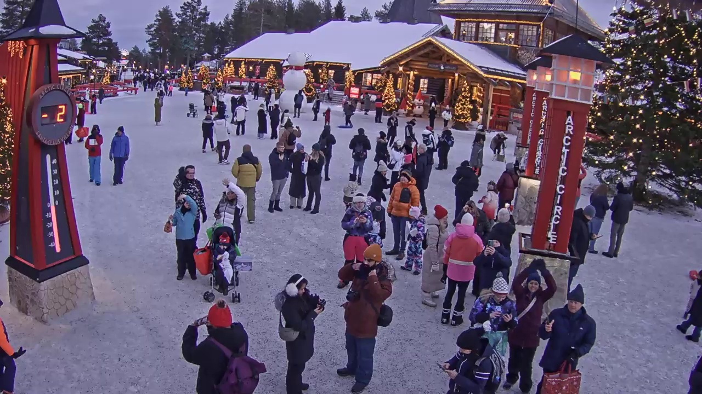
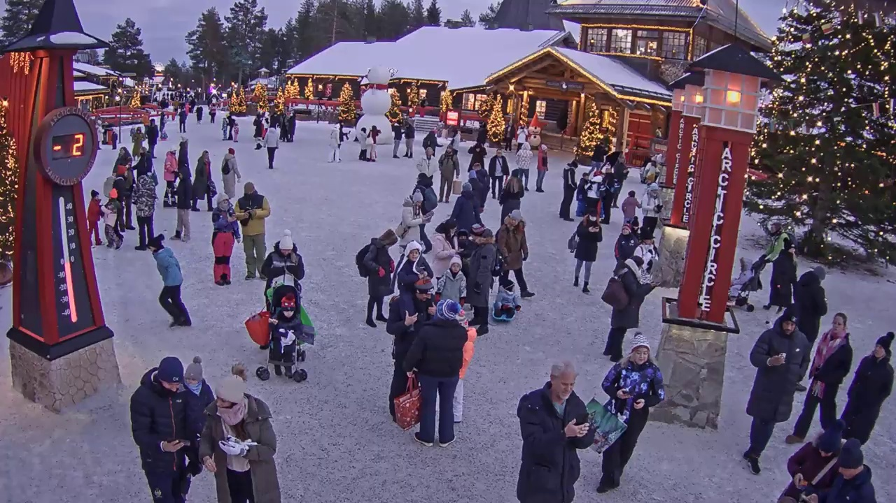
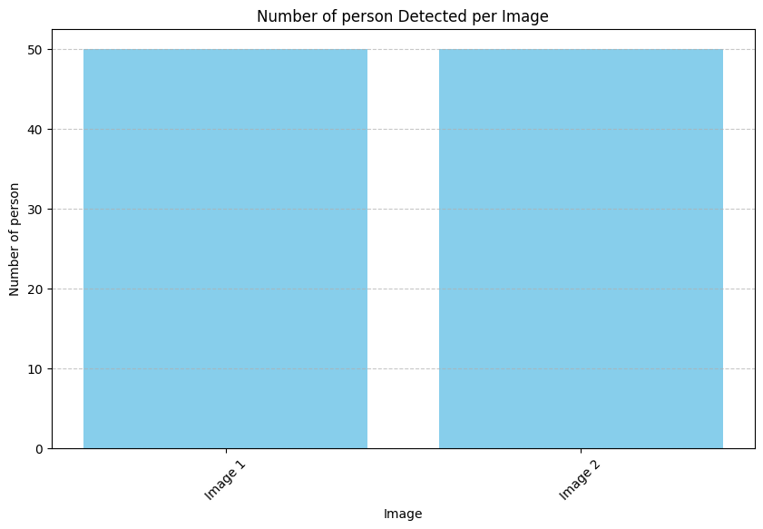
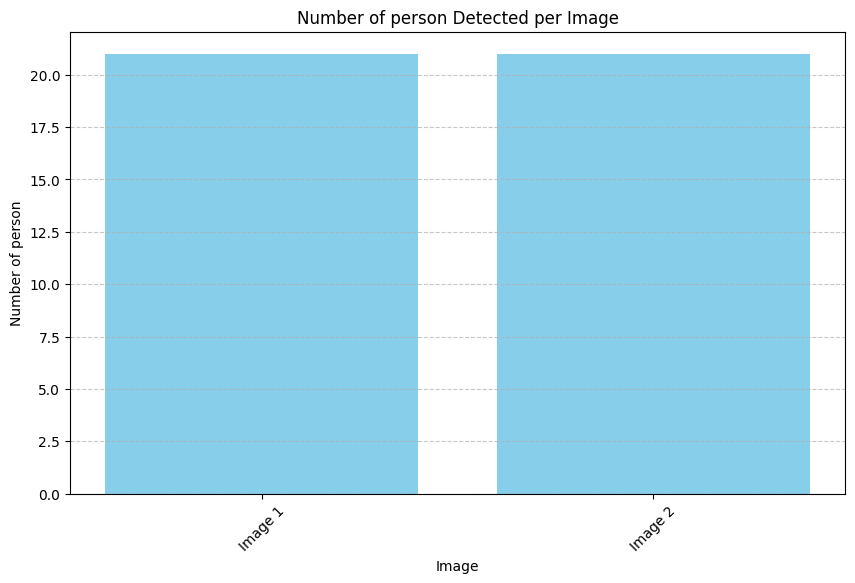
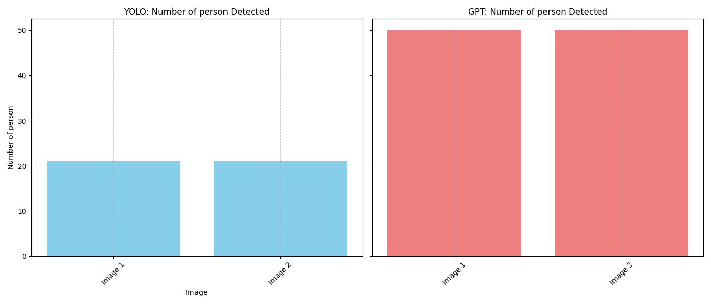
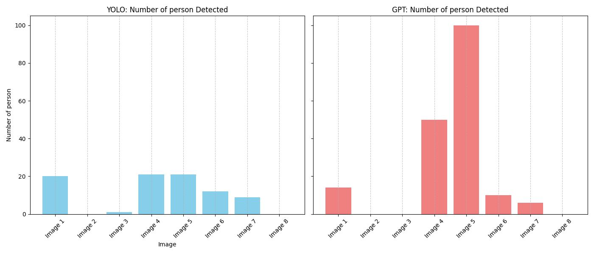

# Plots from GPT


<!-- WARNING: THIS FILE WAS AUTOGENERATED! DO NOT EDIT! -->

## Generating plots from YOLO and GPT vision models

From the current modules in `vision`, we can retrieve information about
an image. These information includes the counts of objects per class.
Therefore, we can plot a bar chart for counts of objects of one class
throughout the image list.

For this example, let us use captured images from Santa Claus Village to
plot the number of people.

``` python
from pathlib import Path
import glob

data_path = Path(os.getenv("LLMCAM_DATA", "../data")).absolute()
files = sorted(glob.glob(f"{data_path}/cap_*.jpg"))
files = [ file for file in files if "santaclausvillage" in file ]
files = files[:2]
```

``` python
from IPython.display import display, Image
display(Image(files[0]))
```



``` python
from IPython.display import display, Image
display(Image(files[1]))
```



``` python
# Define object to count
obj = "person"
```

### Plotting by GPT-4v

``` python
# Initiate counts per image
count = []

# Count objects in images
for image in files:
    info = json.loads(ask_gpt4v_about_image_file(image))
    count.append(info.get(obj, 0))

count
```

    [50, 50]

``` python
plt.figure(figsize=(10, 6))
plt.bar(files, count, color='skyblue')
plt.title(f'Number of {obj} Detected per Image')
plt.xlabel('Image')
plt.ylabel(f'Number of {obj}')
plt.xticks(range(len(files)), [f"Image {i+1}" for i in range(len(files))], rotation=45)
plt.grid(axis='y', linestyle='--', alpha=0.7)
plt.show()
```



### Plotting by YOLO

``` python
# Initiate counts per image
count = []

# Count objects in images
for image in files:
    info = json.loads(detect_objects(image))
    count.append(info.get(obj, 0))

count
```


    image 1/1 /home/nghivo/tinyMLaaS/llmcam/data/cap_2024.12.11_13:59:40_santaclausvillage.jpg: 384x640 21 persons, 2 handbags, 74.3ms
    Speed: 2.0ms preprocess, 74.3ms inference, 582.3ms postprocess per image at shape (1, 3, 384, 640)

    image 1/1 /home/nghivo/tinyMLaaS/llmcam/data/cap_2024.12.11_14:02:23_santaclausvillage.jpg: 384x640 21 persons, 1 backpack, 3 handbags, 18.2ms
    Speed: 2.1ms preprocess, 18.2ms inference, 1.9ms postprocess per image at shape (1, 3, 384, 640)

    [21, 21]

``` python
plt.figure(figsize=(10, 6))
plt.bar(files, count, color='skyblue')
plt.title(f'Number of {obj} Detected per Image')
plt.xlabel('Image')
plt.ylabel(f'Number of {obj}')
plt.xticks(range(len(files)), [f"Image {i+1}" for i in range(len(files))], rotation=45)
plt.grid(axis='y', linestyle='--', alpha=0.7)
plt.show()
```



### Combined and modularized function

We can combine these plots with `pyplot.subplots` and summarize this
whole process into a single function to be integrated into our GPT
Function calling framework:

------------------------------------------------------------------------

<a
href="https://github.com/ninjalabo/llmcam/blob/main/llmcam/vision/plotting.py#L18"
target="_blank" style="float:right; font-size:smaller">source</a>

### plot_object

>  plot_object (images:list[str], object:str, methods:list[str]=['gpt',
>                   'yolo'])

*Generate (only when requested) a bar plot displaying the number of
instances of a specified object detected in a list of images, accepting
only objects in singular form. Change the methods name to lowercase
before passing to the function*

<table>
<colgroup>
<col style="width: 6%" />
<col style="width: 25%" />
<col style="width: 34%" />
<col style="width: 34%" />
</colgroup>
<thead>
<tr>
<th></th>
<th><strong>Type</strong></th>
<th><strong>Default</strong></th>
<th><strong>Details</strong></th>
</tr>
</thead>
<tbody>
<tr>
<td>images</td>
<td>list</td>
<td></td>
<td>List of images to be extracted</td>
</tr>
<tr>
<td>object</td>
<td>str</td>
<td></td>
<td>Object to detect</td>
</tr>
<tr>
<td>methods</td>
<td>list</td>
<td>[‘gpt’, ‘yolo’]</td>
<td>List of methods to use for extracting information. The available
methods are “gpt” and “yolo”</td>
</tr>
</tbody>
</table>

``` python
res = plot_object(files, "person", ["gpt", "yolo"])
path = json.loads(res).get("path")
display(Image(path))
```


    image 1/1 /home/nghivo/tinyMLaaS/llmcam/data/cap_2024.12.11_13:59:40_santaclausvillage.jpg: 384x640 21 persons, 2 handbags, 9.5ms
    Speed: 1.7ms preprocess, 9.5ms inference, 3.4ms postprocess per image at shape (1, 3, 384, 640)

    image 1/1 /home/nghivo/tinyMLaaS/llmcam/data/cap_2024.12.11_14:02:23_santaclausvillage.jpg: 384x640 21 persons, 1 backpack, 3 handbags, 8.8ms
    Speed: 1.7ms preprocess, 8.8ms inference, 2.0ms postprocess per image at shape (1, 3, 384, 640)



## Simulated GPT framework

This section tests integrating with our current GPT framework. This
function can be used in combination with previous functions in the
`vision` module and `file_manager.list_image_files`:

``` python
from llmcam.core.fc import *
from llmcam.core.fn_to_schema import function_schema
from llmcam.utils.file_manager import list_image_files

tools = [
    function_schema(list_image_files, "Local files"),
    function_schema(plot_object, "Plot objects"),
]
messages = form_msgs([
    ("system", "You are a helpful system administrator. Use the supplied tools to assist the user."),
    ("user", "List local image files from Santa Claus Village.")
])
complete(messages, tools=tools)
print_msgs(messages)
```

    >> System:
    You are a helpful system administrator. Use the supplied tools to assist the user.
    >> User:
    List local image files from Santa Claus Village.
    >> Assistant:
    Here are the local image files from Santa Claus Village:  1.
    cap_2025.01.16_18:25:30_santaclausvillage.jpg 2. cap_2025.01.14_02:33:41_santaclausvillage.jpg 3.
    cap_2025.01.14_01:52:14_santaclausvillage.jpg 4. cap_2024.12.11_14:02:23_santaclausvillage.jpg 5.
    cap_2024.12.11_13:59:40_santaclausvillage.jpg 6. cap_2024.12.09_20:33:06_santaclausvillege.jpg 7.
    cap_2024.12.09_20:32:50_santaclausvillege.jpg 8. cap_2025.01.14_02:14:33_santaclausvillage.jpg  Let
    me know if you need further assistance!

``` python
# Continue the conversation and plot using both methods
messages.append(form_msg("user", "Plot the number of people detected in the images using both YOLO and GPT-4 Vision. Tell me the path to the plot."))
complete(messages, tools=tools)
print_msgs(messages)
```


    image 1/1 /home/nghivo/tinyMLaaS/llmcam/data/cap_2025.01.16_18:25:30_santaclausvillage.jpg: 384x640 20 persons, 1 handbag, 35.1ms
    Speed: 3.0ms preprocess, 35.1ms inference, 4.5ms postprocess per image at shape (1, 3, 384, 640)

    image 1/1 /home/nghivo/tinyMLaaS/llmcam/data/cap_2025.01.14_02:33:41_santaclausvillage.jpg: 384x640 (no detections), 28.0ms
    Speed: 2.4ms preprocess, 28.0ms inference, 0.8ms postprocess per image at shape (1, 3, 384, 640)

    image 1/1 /home/nghivo/tinyMLaaS/llmcam/data/cap_2025.01.14_01:52:14_santaclausvillage.jpg: 384x640 1 person, 11.7ms
    Speed: 2.0ms preprocess, 11.7ms inference, 4.5ms postprocess per image at shape (1, 3, 384, 640)

    image 1/1 /home/nghivo/tinyMLaaS/llmcam/data/cap_2024.12.11_14:02:23_santaclausvillage.jpg: 384x640 21 persons, 1 backpack, 3 handbags, 10.6ms
    Speed: 1.4ms preprocess, 10.6ms inference, 1.3ms postprocess per image at shape (1, 3, 384, 640)

    image 1/1 /home/nghivo/tinyMLaaS/llmcam/data/cap_2024.12.11_13:59:40_santaclausvillage.jpg: 384x640 21 persons, 2 handbags, 9.7ms
    Speed: 1.5ms preprocess, 9.7ms inference, 1.3ms postprocess per image at shape (1, 3, 384, 640)

    image 1/1 /home/nghivo/tinyMLaaS/llmcam/data/cap_2024.12.09_20:33:06_santaclausvillege.jpg: 384x640 12 persons, 25.9ms
    Speed: 1.7ms preprocess, 25.9ms inference, 1.5ms postprocess per image at shape (1, 3, 384, 640)

    image 1/1 /home/nghivo/tinyMLaaS/llmcam/data/cap_2024.12.09_20:32:50_santaclausvillege.jpg: 384x640 9 persons, 1 potted plant, 13.1ms
    Speed: 1.8ms preprocess, 13.1ms inference, 1.6ms postprocess per image at shape (1, 3, 384, 640)

    image 1/1 /home/nghivo/tinyMLaaS/llmcam/data/cap_2025.01.14_02:14:33_santaclausvillage.jpg: 384x640 (no detections), 11.6ms
    Speed: 1.8ms preprocess, 11.6ms inference, 1.0ms postprocess per image at shape (1, 3, 384, 640)
    >> System:
    You are a helpful system administrator. Use the supplied tools to assist the user.
    >> User:
    List local image files from Santa Claus Village.
    >> Assistant:
    Here are the local image files from Santa Claus Village:  1.
    cap_2025.01.16_18:25:30_santaclausvillage.jpg 2. cap_2025.01.14_02:33:41_santaclausvillage.jpg 3.
    cap_2025.01.14_01:52:14_santaclausvillage.jpg 4. cap_2024.12.11_14:02:23_santaclausvillage.jpg 5.
    cap_2024.12.11_13:59:40_santaclausvillage.jpg 6. cap_2024.12.09_20:33:06_santaclausvillege.jpg 7.
    cap_2024.12.09_20:32:50_santaclausvillege.jpg 8. cap_2025.01.14_02:14:33_santaclausvillage.jpg  Let
    me know if you need further assistance!
    >> User:
    Plot the number of people detected in the images using both YOLO and GPT-4 Vision. Tell me the path
    to the plot.
    >> Assistant:
    The plot showing the number of people detected in the images using both YOLO and GPT-4 Vision has
    been generated. You can find the plot at the following path:
    `/home/nghivo/tinyMLaaS/llmcam/data/667_object_count_plot.jpg`

``` python
display(Image('/home/nghivo/tinyMLaaS/llmcam/data/667_object_count_plot.jpg'))
```


