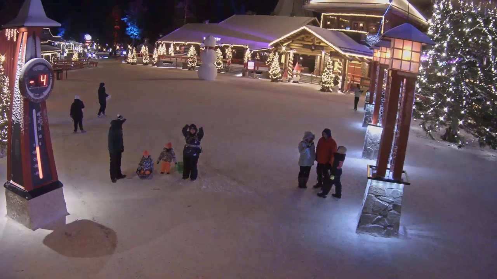
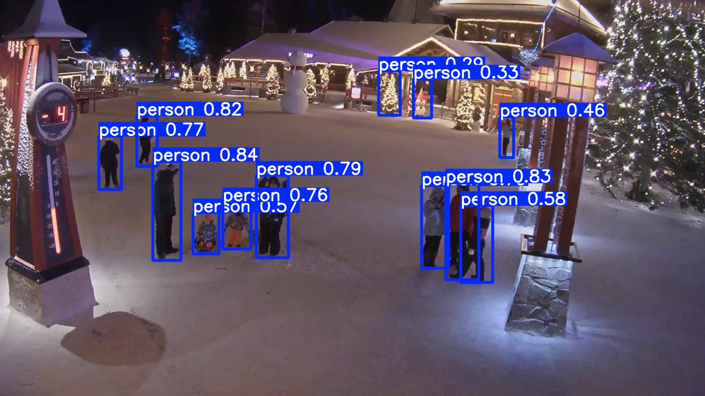

# YOLO


<!-- WARNING: THIS FILE WAS AUTOGENERATED! DO NOT EDIT! -->

## Detecting objects with YOLO

Apart from processing images with GPT vision model, we can also use a
YOLO model to detect objects in images. This section demonstrate this
process, starting with a captured image of Santa Claus Village:

``` python
import os
from IPython.display import Image

data_path = os.getenv("LLMCAM_DATA", "../data")
file = f"{data_path}/cap_2024.12.09_20:33:06_santaclausvillege.jpg"
Image(file)
```



Detect objects as bounding boxes with a YOLO model:

``` python
# Load pretrained YOLO model
model = YOLO('yolov8s.pt')

# Get detections
result = model(file, conf=0.25, exist_ok=True)[0]

# Save results as image
save_dir = os.getenv("LLMCAM_DATA", "../data")
output_path = file.split("/")[-1]
result.save(filename=f"{save_dir}/detection_{output_path}")

# Display results
Image(f"{save_dir}/detection_{output_path}")
```


    image 1/1 /home/nghivo/tinyMLaaS/llmcam/data/cap_2024.12.09_20:33:06_santaclausvillege.jpg: 384x640 12 persons, 13.4ms
    Speed: 1.3ms preprocess, 13.4ms inference, 1.3ms postprocess per image at shape (1, 3, 384, 640)



Detected objects can be summarized with counts of objects per class.
This summarized information is useful as tool results for our GPT
Function calling framework.

``` python
# Count objects per class
dict = {}
for c in result.boxes.cls:
    dict[model.names[int(c)]] = dict.get(model.names[int(c)], 0) + 1
json.dumps(dict)
```

    '{"person": 12}'

Modularized operations:

------------------------------------------------------------------------

<a
href="https://github.com/ninjalabo/llmcam/blob/main/llmcam/vision/yolo.py#L15"
target="_blank" style="float:right; font-size:smaller">source</a>

### detect_objects

>  detect_objects (image_path:str, conf:Optional[float]=0.25)

*Detect object in the input image using YOLO model.*

<table>
<thead>
<tr>
<th></th>
<th><strong>Type</strong></th>
<th><strong>Default</strong></th>
<th><strong>Details</strong></th>
</tr>
</thead>
<tbody>
<tr>
<td>image_path</td>
<td>str</td>
<td></td>
<td>Path/URL of image</td>
</tr>
<tr>
<td>conf</td>
<td>Optional</td>
<td>0.25</td>
<td>Confidence threshold</td>
</tr>
<tr>
<td><strong>Returns</strong></td>
<td><strong>str</strong></td>
<td></td>
<td><strong>JSON format of detection results</strong></td>
</tr>
</tbody>
</table>

Test usage:

``` python
detect_objects(file, 0.25)
```


    image 1/1 /home/nghivo/tinyMLaaS/llmcam/data/cap_2024.12.09_20:33:06_santaclausvillege.jpg: 384x640 12 persons, 12.4ms
    Speed: 1.7ms preprocess, 12.4ms inference, 2.8ms postprocess per image at shape (1, 3, 384, 640)

    '{"person": 12}'

## Simulated GPT workflow

This section tests integrating with our current GPT framework. This
function can be used in combination with previous functions in the
`vision` module:

``` python
from llmcam.core.fc import *
from llmcam.core.fn_to_schema import function_schema
from llmcam.vision.ytlive import capture_youtube_live_frame
from llmcam.vision.gpt4v import ask_gpt4v_about_image_file

tools = [
    function_schema(capture_youtube_live_frame, "Youtube Live Capture"),
    function_schema(ask_gpt4v_about_image_file, "GPT4 Vision"),
    function_schema(detect_objects, "YOLO Object Detection")
]
messages = form_msgs([
    ("system", "You are a helpful system administrator. Use the supplied tools to assist the user."),
    ("user", "Capture an image from this Youtube Live at Santa Claus Village: https://www.youtube.com/watch?v=Cp4RRAEgpeU")
])
complete(messages, tools=tools)
print_msgs(messages)
```

    [youtube] Extracting URL: https://www.youtube.com/watch?v=Cp4RRAEgpeU
    [youtube] Cp4RRAEgpeU: Downloading webpage
    [youtube] Cp4RRAEgpeU: Downloading ios player API JSON
    [youtube] Cp4RRAEgpeU: Downloading mweb player API JSON
    [youtube] Cp4RRAEgpeU: Downloading m3u8 information
    [youtube] Cp4RRAEgpeU: Downloading m3u8 information
    >> System:
    You are a helpful system administrator. Use the supplied tools to assist the user.
    >> User:
    Capture an image from this Youtube Live at Santa Claus Village:
    https://www.youtube.com/watch?v=Cp4RRAEgpeU
    >> Assistant:
    I have captured an image from the YouTube Live stream at Santa Claus Village. If you need further
    analysis or have any questions about this image, feel free to ask!

``` python
# Continue the conversation and detect the number of people in the image
messages.append(form_msg("user", "Can you find out how many people there are in this image?"))
complete(messages, tools=tools)
print_msgs(messages)
```


    image 1/1 /home/nghivo/tinyMLaaS/llmcam/data/cap_2024.12.12_09:37:48_None.jpg: 384x640 19 persons, 2 backpacks, 48.7ms
    Speed: 5.4ms preprocess, 48.7ms inference, 189.9ms postprocess per image at shape (1, 3, 384, 640)
    >> System:
    You are a helpful system administrator. Use the supplied tools to assist the user.
    >> User:
    Capture an image from this Youtube Live at Santa Claus Village:
    https://www.youtube.com/watch?v=Cp4RRAEgpeU
    >> Assistant:
    I have captured an image from the YouTube Live stream at Santa Claus Village. If you need further
    analysis or have any questions about this image, feel free to ask!
    >> User:
    Can you find out how many people there are in this image?
    >> Assistant:
    There are 19 people detected in the captured image from the YouTube Live stream at Santa Claus
    Village. If you have any more questions or need further assistance, feel free to ask!
