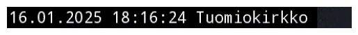
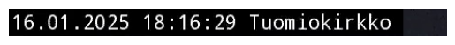

# YouTube Live Capture


<!-- WARNING: THIS FILE WAS AUTOGENERATED! DO NOT EDIT! -->

## Youtube Live Capture experiment

This experiment focuses on capturing Youtube Live from public cameras
monitoring multiple Näkymä Helsingistä locations. We can first extract
information about the Youtube Live using the library `yt_dlp`.

------------------------------------------------------------------------

<a
href="https://github.com/ninjalabo/llmcam/blob/main/llmcam/vision/ytlive.py#L48"
target="_blank" style="float:right; font-size:smaller">source</a>

### stream_url

>  stream_url (ytlive_url:str, ydl_opts:dict)

``` python
stream_url(nakyma_helsinkigista_youtube_live_url, ydl_opts)
```

    WARNING: skipping cookie file entry due to invalid length 1: '<<<<<<< Updated upstream\n'
    WARNING: skipping cookie file entry due to invalid length 1: '=======\n'
    WARNING: skipping cookie file entry due to invalid length 1: '<<<<<<< Updated upstream\n'
    WARNING: skipping cookie file entry due to invalid length 1: '=======\n'
    WARNING: skipping cookie file entry due to invalid length 1: '>>>>>>> Stashed changes\n'
    WARNING: skipping cookie file entry due to invalid length 1: '>>>>>>> Stashed changes\n'

    [youtube] Extracting URL: https://www.youtube.com/watch?v=LMZQ7eFhm58
    [youtube] LMZQ7eFhm58: Downloading webpage
    [youtube] LMZQ7eFhm58: Downloading ios player API JSON
    [youtube] LMZQ7eFhm58: Downloading tv player API JSON
    [youtube] LMZQ7eFhm58: Downloading m3u8 information

    'https://manifest.googlevideo.com/api/manifest/hls_playlist/expire/1737066322/ei/8jKJZ-nWNJyp0u8Ph4j02Qc/ip/82.130.25.234/id/LMZQ7eFhm58.5/itag/232/source/yt_live_broadcast/requiressl/yes/ratebypass/yes/live/1/sgovp/gir%3Dyes%3Bitag%3D136/rqh/1/hdlc/1/hls_chunk_host/rr2---sn-ovgq0oxu-5goe.googlevideo.com/xpc/EgVo2aDSNQ%3D%3D/playlist_duration/3600/manifest_duration/3600/bui/AY2Et-Mi4NLCHEnUJHV_9eqYR8g08BW8IZfGiBVX_kOGk7D2vzSK7U1SO_4Hb_pv0W5mLfmOnwsBer6x/spc/9kzgDYpIzXWTvXc1Vu_1AvYIGD9IHtRMn__-I56lIB7V9sJ72F0P/vprv/1/playlist_type/DVR/initcwndbps/4483750/met/1737044723,/mh/l8/mm/44/mn/sn-ovgq0oxu-5goe/ms/lva/mv/m/mvi/2/pl/18/rms/lva,lva/dover/13/pacing/0/short_key/1/keepalive/yes/fexp/51326932,51335594,51353498,51371294,51384461/mt/1737044203/sparams/expire,ei,ip,id,itag,source,requiressl,ratebypass,live,sgovp,rqh,hdlc,xpc,playlist_duration,manifest_duration,bui,spc,vprv,playlist_type/sig/AJfQdSswRQIhANUtoKCOb5u3JtOLa2QGQR5RQKdJ5PyDc9j8CbfWfBO2AiBaU_ySIFkC7dvK2VlOBWeKwYWtBITdimZW6sScNBTttw%3D%3D/lsparams/hls_chunk_host,initcwndbps,met,mh,mm,mn,ms,mv,mvi,pl,rms/lsig/AGluJ3MwRgIhAOk99P4NUNKgNCKsLE11eZe62AeQ_6DPuvxkKxi3sr7cAiEAmVHKhNZ1OZV3HpKU5L71VjOY5SkV05GYwJblbKW-nEk%3D/playlist/index.m3u8'

At this point, we have obtained a special link for downloading captures
from this livestream. This URL is a dynamically generated link used by
YouTube for delivering live streaming content via an HLS (HTTP Live
Streaming) protocol. We can proceed to donwload content chunks from this
link with `cv2`.

**NOTE**: This livestream contains a small frame at top left corner to
display the current time and location. We can attempt to crop this small
frame and extract further information from the captured image.

------------------------------------------------------------------------

<a
href="https://github.com/ninjalabo/llmcam/blob/main/llmcam/vision/ytlive.py#L58"
target="_blank" style="float:right; font-size:smaller">source</a>

### show_frame

>  show_frame (frame)

------------------------------------------------------------------------

<a
href="https://github.com/ninjalabo/llmcam/blob/main/llmcam/vision/ytlive.py#L65"
target="_blank" style="float:right; font-size:smaller">source</a>

### crop_frame

>  crop_frame (frame, crop=(0, 0, 480, 30))

------------------------------------------------------------------------

<a
href="https://github.com/ninjalabo/llmcam/blob/main/llmcam/vision/ytlive.py#L70"
target="_blank" style="float:right; font-size:smaller">source</a>

### frame_to_text

>  frame_to_text (frame)

------------------------------------------------------------------------

<a
href="https://github.com/ninjalabo/llmcam/blob/main/llmcam/vision/ytlive.py#L73"
target="_blank" style="float:right; font-size:smaller">source</a>

### known

>  known (txt:str, known_places:str)

*Try to find one of `known_places` are included in the given `txt`*

------------------------------------------------------------------------

<a
href="https://github.com/ninjalabo/llmcam/blob/main/llmcam/vision/ytlive.py#L82"
target="_blank" style="float:right; font-size:smaller">source</a>

### meta

>  meta (frame, known_places=['Olympiaterminaali', 'Etelasatama',
>            'Eteladsatama', 'Presidentinlinna', 'Tuomiokirkko', 'Kauppatori',
>            'Kauppator', 'Torni', 'Valkosaari'], printing=False)

*Withdraw meta data, datetime & place*

------------------------------------------------------------------------

<a
href="https://github.com/ninjalabo/llmcam/blob/main/llmcam/vision/ytlive.py#L95"
target="_blank" style="float:right; font-size:smaller">source</a>

### fname

>  fname (prefix, dt, pl)

Test workflow combining the above utilities and try saving the
downloaded file in a local directory:

``` python
url = stream_url(nakyma_helsinkigista_youtube_live_url, ydl_opts)
cap = cv2.VideoCapture(url)
ret, frame = cap.read()
if ret:
    print("Cropped frame:")
    show_frame(crop_frame(frame))

    print("Text in cropped frame:", frame_to_text(crop_frame(frame)))
    try:
        file_name = fname("cap_", *meta(crop_frame(frame), printing=True))
    except:
        file_name = fname("fail_", datetime.now(), "nowhere")
    print("File name:", file_name)
    path = Path(os.getenv("LLMCAM_DATA", "../data"))/file_name
    path.parent.mkdir(parents=True, exist_ok=True)
    cv2.imwrite(path, frame)
    print("Saved to:", path)
else:
    print("Failed to capture frame.")
```

    [youtube] Extracting URL: https://www.youtube.com/watch?v=LMZQ7eFhm58
    [youtube] LMZQ7eFhm58: Downloading webpage
    [youtube] LMZQ7eFhm58: Downloading ios player API JSON
    [youtube] LMZQ7eFhm58: Downloading tv player API JSON
    [youtube] LMZQ7eFhm58: Downloading m3u8 information
    Cropped frame:



    Text in cropped frame: 16.01.2025 18:16:24 Tuomiokirkko
    16.01.2025 18:16:24 Tuomiokirkko
    File name: cap_2025.01.16_18:16:24_Tuomiokirkko.jpg
    Saved to: /home/nghivo/tinyMLaaS/llmcam/data/cap_2025.01.16_18:16:24_Tuomiokirkko.jpg

As such, we can follow this guideline for implementing the modularized
functions:

1.  Extract HSL URL from Youtube Live  
2.  Capture live images with this URL  
3.  Crop small frame and extract further metadata from captured images  
4.  Form suitable file names and save captured images

## Modularize with Live instances

This section implements the modularized functions with Object-Oriented
Programming approach (OOP). Each Youtube Live is managed by a
[`YTLive`](https://ninjalabo.github.io/llmcam/vision/ytlive.html#ytlive)
instance, which captures images from its live stream when prompted.

### General Live instance

**NOTE**: For a generic Youtube Live stream, step 3 in the described
workflow is skipped and file name is generated as a combination of the
current timestamp and user-input location.

------------------------------------------------------------------------

<a
href="https://github.com/ninjalabo/llmcam/blob/main/llmcam/vision/ytlive.py#L98"
target="_blank" style="float:right; font-size:smaller">source</a>

### YTLive

>  YTLive (url:str, data_dir:Optional[pathlib.Path]=Path('../data'),
>              place:Optional[str]='nowhere')

*Initialize self. See help(type(self)) for accurate signature.*

<table>
<thead>
<tr>
<th></th>
<th><strong>Type</strong></th>
<th><strong>Default</strong></th>
<th><strong>Details</strong></th>
</tr>
</thead>
<tbody>
<tr>
<td>url</td>
<td>str</td>
<td></td>
<td>YouTube Live URL</td>
</tr>
<tr>
<td>data_dir</td>
<td>Optional</td>
<td>../data</td>
<td>Directory to store captured images</td>
</tr>
<tr>
<td>place</td>
<td>Optional</td>
<td>nowhere</td>
<td>Location name</td>
</tr>
</tbody>
</table>

Test usage with a different live stream of Santa Claus Village:

``` python
SantaClausVillage = YTLive(url="https://www.youtube.com/live/Cp4RRAEgpeU?si=IwqJ4QU1Umv9PdgW", place="santaclausvillage")
file = SantaClausVillage()
print()
print("File path:", file)
```

    [youtube] Extracting URL: https://www.youtube.com/live/Cp4RRAEgpeU?si=IwqJ4QU1Umv9PdgW
    [youtube] Cp4RRAEgpeU: Downloading webpage
    [youtube] Cp4RRAEgpeU: Downloading ios player API JSON
    [youtube] Cp4RRAEgpeU: Downloading tv player API JSON
    [youtube] Cp4RRAEgpeU: Downloading m3u8 information

    File path: /home/nghivo/tinyMLaaS/llmcam/data/cap_2025.01.16_18:25:30_santaclausvillage.jpg

### Näkymä Helsingistä Live instance

We also add a special support for Näkymä Helsingistä livestream that
utilizes the small frame at top left corner to extract metadata and
generate file names. This is a subclass that inherits all other
functions from
[`YTLive`](https://ninjalabo.github.io/llmcam/vision/ytlive.html#ytlive)
while modifying the `file_name` function.

------------------------------------------------------------------------

<a
href="https://github.com/ninjalabo/llmcam/blob/main/llmcam/vision/ytlive.py#L127"
target="_blank" style="float:right; font-size:smaller">source</a>

### NHsta

>  NHsta (url:Optional[str]='https://www.youtube.com/watch?v=LMZQ7eFhm58',
>             data_dir:Optional[pathlib.Path]=Path('../data'),
>             place:Optional[str]='unclear')

*Initialize self. See help(type(self)) for accurate signature.*

<table>
<colgroup>
<col style="width: 6%" />
<col style="width: 25%" />
<col style="width: 34%" />
<col style="width: 34%" />
</colgroup>
<thead>
<tr>
<th></th>
<th><strong>Type</strong></th>
<th><strong>Default</strong></th>
<th><strong>Details</strong></th>
</tr>
</thead>
<tbody>
<tr>
<td>url</td>
<td>Optional</td>
<td>https://www.youtube.com/watch?v=LMZQ7eFhm58</td>
<td>YouTube Live URL</td>
</tr>
<tr>
<td>data_dir</td>
<td>Optional</td>
<td>../data</td>
<td>Directory to store captured images</td>
</tr>
<tr>
<td>place</td>
<td>Optional</td>
<td>unclear</td>
<td>Location name if OCR fails</td>
</tr>
</tbody>
</table>

Test usage:

``` python
NakymaHelsingista = NHsta()
file = NakymaHelsingista()
print()
print("File path:", file)
```

    [youtube] Extracting URL: https://www.youtube.com/watch?v=LMZQ7eFhm58
    [youtube] LMZQ7eFhm58: Downloading webpage
    [youtube] LMZQ7eFhm58: Downloading ios player API JSON
    [youtube] LMZQ7eFhm58: Downloading tv player API JSON
    [youtube] LMZQ7eFhm58: Downloading m3u8 information
    16.01.2025 18:16:29 Tuomiokirkko

    File path: /home/nghivo/tinyMLaaS/llmcam/data/cap_2025.01.16_18:16:29_Tuomiokirkko.jpg

Try showing the cropped small frame from saved file:

``` python
def crop_image(path, crop=(0, 0, 480, 30)): return Image.open(path).crop(crop)
def show_image(path):
    plt.imshow(crop_image(path))
    plt.axis('off')
    plt.show()

show_image(file)
```



### General-purpose function for Function calling

For simplification purpose, we implement a general-purpose function that
initiate these Live instances and download file to be used in GPT
Function calling:

------------------------------------------------------------------------

<a
href="https://github.com/ninjalabo/llmcam/blob/main/llmcam/vision/ytlive.py#L145"
target="_blank" style="float:right; font-size:smaller">source</a>

### capture_youtube_live_frame

>  capture_youtube_live_frame (link:Optional[str]=None,
>                                  place:Optional[str]=None)

*Capture a jpeg image from YouTube Live and return the path to the saved
image*

<table>
<thead>
<tr>
<th></th>
<th><strong>Type</strong></th>
<th><strong>Default</strong></th>
<th><strong>Details</strong></th>
</tr>
</thead>
<tbody>
<tr>
<td>link</td>
<td>Optional</td>
<td>None</td>
<td>YouTube Live link</td>
</tr>
<tr>
<td>place</td>
<td>Optional</td>
<td>None</td>
<td>Location of live image</td>
</tr>
<tr>
<td><strong>Returns</strong></td>
<td><strong>str</strong></td>
<td></td>
<td><strong>Path to the saved image</strong></td>
</tr>
</tbody>
</table>

### Utility function for default Youtube Links

Utility function for saving and retrieving some notable Youtube links.

------------------------------------------------------------------------

<a
href="https://github.com/ninjalabo/llmcam/blob/main/llmcam/vision/ytlive.py#L159"
target="_blank" style="float:right; font-size:smaller">source</a>

### select_youtube_live_url

>  select_youtube_live_url (location:Optional[str]='Helsinki')

*Select the Youtube Live URL based on the location name*

<table>
<colgroup>
<col style="width: 6%" />
<col style="width: 25%" />
<col style="width: 34%" />
<col style="width: 34%" />
</colgroup>
<thead>
<tr>
<th></th>
<th><strong>Type</strong></th>
<th><strong>Default</strong></th>
<th><strong>Details</strong></th>
</tr>
</thead>
<tbody>
<tr>
<td>location</td>
<td>Optional</td>
<td>Helsinki</td>
<td>Location name, one of [“santaclausvillage”, “parkinglot”,
“helsinki”, “satellite”]</td>
</tr>
</tbody>
</table>

## Simulated GPT workflow

Test integrating with our current GPT framework:

``` python
from llmcam.core.fc import *
from llmcam.core.fn_to_schema import function_schema

tools = [function_schema(capture_youtube_live_frame, "Youtube Live Capture")]
messages = form_msgs([
    ("system", "You are a helpful system administrator. Use the supplied tools to assist the user."),
    ("user", "Hi, can you capture YouTube Live?")
])
complete(messages, tools)
print_msgs(messages)
```

    >> System:
    You are a helpful system administrator. Use the supplied tools to assist the user.
    >> User:
    Hi, can you capture YouTube Live?
    >> Assistant:
    Yes, I can capture an image from a YouTube Live stream. Please provide the YouTube Live link, and if
    applicable, specify the location or place you want the image to represent.

``` python
# Continue the conversation
messages.append(form_msg("user", "You can use the default link."))
complete(messages, tools=tools)
print_msgs(messages)
```

    [youtube] Extracting URL: https://www.youtube.com/watch?v=LMZQ7eFhm58
    [youtube] LMZQ7eFhm58: Downloading webpage
    [youtube] LMZQ7eFhm58: Downloading ios player API JSON
    [youtube] LMZQ7eFhm58: Downloading tv player API JSON
    [youtube] LMZQ7eFhm58: Downloading m3u8 information
    16.01.2025 18:16:39 Tuomiokirkko
    >> System:
    You are a helpful system administrator. Use the supplied tools to assist the user.
    >> User:
    Hi, can you capture YouTube Live?
    >> Assistant:
    Yes, I can capture an image from a YouTube Live stream. Please provide the YouTube Live link, and if
    applicable, specify the location or place you want the image to represent.
    >> User:
    You can use the default link.
    >> Assistant:
    I have captured an image from the default YouTube Live stream. You can view it
    [here](sandbox:/home/nghivo/tinyMLaaS/llmcam/data/cap_2025.01.16_18:16:39_Tuomiokirkko.jpg).

Another scenario (selecting with location):

``` python
from llmcam.core.fc import *
from llmcam.core.fn_to_schema import function_schema

tools = [
    function_schema(capture_youtube_live_frame, "Youtube Live Capture"),
    function_schema(select_youtube_live_url, "Select Youtube Live URL")
]
messages = form_msgs([
    ("system", "You are a helpful system administrator. Use the supplied tools to assist the user."),
    ("user", "Hi, can you capture an image from Santa Claus Village?")
])
complete(messages, tools)
print_msgs(messages)
```

    [youtube] Extracting URL: https://www.youtube.com/watch?v=Cp4RRAEgpeU
    [youtube] Cp4RRAEgpeU: Downloading webpage
    [youtube] Cp4RRAEgpeU: Downloading ios player API JSON
    [youtube] Cp4RRAEgpeU: Downloading tv player API JSON
    [youtube] Cp4RRAEgpeU: Downloading m3u8 information
    >> System:
    You are a helpful system administrator. Use the supplied tools to assist the user.
    >> User:
    Hi, can you capture an image from Santa Claus Village?
    >> Assistant:
    I've captured an image from Santa Claus Village for you. You can view it here: [Santa Claus Village
    Live
    Image](sandbox:/home/nghivo/tinyMLaaS/llmcam/data/cap_2025.01.16_18:25:47_santaclausvillage.jpg).
